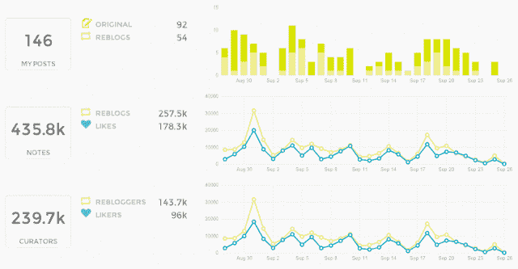

# Tumblr 认可的分析平台 Union Metrics 现在对个人免费，专业人士负担得起 

> 原文：<https://web.archive.org/web/https://techcrunch.com/2013/07/16/tumblr-endorsed-analytics-platform-union-metrics-now-free-for-individuals-affordable-for-pros/>

Union Metrics 是第一个 Tumblr 支持的分析平台的提供商，该平台现在由雅虎(Yahoo)旗下的博客网络提供，该公司今天升级了其功能集，并为其服务引入了更低成本和免费的层级。这些变化是为了让专业博客作者、小企业和个人更能负担得起 Tumblr 分析。较低费用层将允许用户每月花费 25 美元跟踪最多三个 Tumblr 博客，而免费层仅允许用户跟踪一个博客。

[Tumblr 本身](https://web.archive.org/web/20221208074553/http://a-listpartners.tumblr.com/post/35180834467/union-metrics-for-tumblr-provides-detailed-tumblr) [早在 2012 年 11 月就推动了](https://web.archive.org/web/20221208074553/https://twitter.com/tumblr/status/274204551387688961)Union Metrics 的推出，当时它首次推出了三个[昂贵的](https://web.archive.org/web/20221208074553/http://www.businessinsider.com/want-tumblr-analytics-here-is-the-absurd-price-youll-have-to-pay-2012-12)专业级计划，起价为 499 美元，面向更大的企业和品牌。然而，当时 Union Metrics 表示，它将在未来某个时候为任何有兴趣跟踪其个人博客的人提供计划。

该公司与 Tumblr 的关系允许它访问 Tumblr 数据的完整“消防软管”，包括博客、转发博客和赞，以及跟踪除了你自己操作的博客之外的博客或任何主题(关键词跟踪)的能力。然后，这些数据可以在交互式图表中可视化，并导出到其他地方使用。

虽然 Tumblr 的声誉是为了迎合年轻人，时髦的人，有时是寻求隐私的试图反抗过度分享的时代，但一个拥有超过 1.22 亿博客和超过 550 亿帖子的网站一定会吸引营销人员，品牌，大型出版商和广告商的注意。Tumblr 也是如此。联合度量公司也是如此。到目前为止，Union Metrics 已经签约的客户包括滑稽或死亡、Puma、耶鲁大学、氡之家、Digg、We Are Social、罗德岛设计学院和 Hyatt。该公司拒绝提供客户数量，但在 11 月份首次亮相时有 150 名客户。

这些用户和其他订阅 Union Metrics analytics 服务的用户现在将能够访问一个热门功能，即跟踪博客粉丝的能力，以及将 Union Metrics 服务与 Google Analytics 集成。

如上所述，低成本层允许跟踪三个博客，但对于那些无法证明费用合理的个人，Union Metrics 今天也推出了一个免费计划，它以前曾通过私人测试访问的等候名单戏弄过[。仅对于一个博客，用户可以跟踪一段时间内的帖子和笔记数量、关注者、单个帖子的表现，以及识别影响者、博客标签和帖子类型的表现，并可视化再博客的传播。](https://web.archive.org/web/20221208074553/http://unionmetrics.com/fyeah/)

自推出以来，Union Metrics 已经处理了超过 400 亿篇 Tumblr 博客帖子、转发博客和赞。还有一些其他的 Tumblr 分析提供商，但它们是更基本的工具，如 TumblrStats.com 的 [Numblr](https://web.archive.org/web/20221208074553/http://tumblr.undercurrent.com/) 或[T5，或那些不是为 Tumblr 定制的](https://web.archive.org/web/20221208074553/http://tumblrstats.com/) [Statcounter](https://web.archive.org/web/20221208074553/http://statcounter.com/tumblr/) 。Union Metics 是唯一同时也是 Tumblr 合作伙伴的服务。

新的层级将在 Tumblr 网站的[Union Metrics here](https://web.archive.org/web/20221208074553/http://unionmetrics.com/products/tumblr/)上提供。