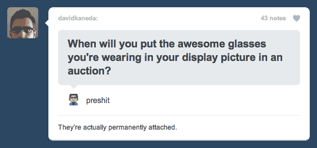

# 受 Formspring 的“启发”, Tumblr 推出了几乎相同的“问我”, 

> 原文：<https://web.archive.org/web/https://techcrunch.com/2010/01/06/tumblr-formspring/>

# 受 Formspring 的“启发”, Tumblr 推出了几乎相同的“问我”

还记得 [Formspring.me](https://web.archive.org/web/20221209132318/http://www.formspring.me/) 吗，两天前我们[报道过](https://web.archive.org/web/20221209132318/http://www.beta.techcrunch.com/2010/01/04/formspring-ask-me-anything/)的一项服务，这项服务让你在网上进行在线问答变得很容易？热门微博服务 [Tumblr](https://web.archive.org/web/20221209132318/http://www.tumblr.com/) 刚刚[推出](https://web.archive.org/web/20221209132318/http://staff.tumblr.com/post/320191537/ask)一个名为“问我”的新功能，做完全相同的事情。

新功能很简单:如果你有一个 Tumblr 博客，你现在可以添加一个表格，让你的读者问你他们想要什么。他们可以匿名提问，或者在提交问题时附上自己的账户名。然后，你可以挑选你想回答的问题，并把你的回答发布到你的博客上。

当然，这正是 Formspring.me 所做的。Tumblr 用户实际上已经使用通用的 HTML 表单生成器建立了自己的问答，这就是驱动 [Formspring](https://web.archive.org/web/20221209132318/http://www.formspring.com/) (表单生成器本身)为 Q &建立一个名为 Formspring.me 的专用服务的原因。Formspring.me 已经在 Tumblr 上获得了相当多的追随者，所以博客平台决定将其纳入也就不足为奇了。首席执行官戴维·卡普说这个功能是“从我们的社区与 Tumblr Submissions、Wufoo 和 Formspring 一起分享的 Q & A 帖子中得到的灵感”

不过，对于 Formspring.me 来说，一切还没有结束。首席执行官 Ade Olonoh 表示，虽然 Tumblr 是 Formspring.me 的良好孵化器，但这项服务已经远远超出了该网站。他说，在过去几天里，Formspring.me 上回答的问题中，只有大约 3-4%被整合到 Tumblr 上。我怀疑这些数字是扭曲的，因为 Formspring.me 最近被许多大型科技博客所覆盖，但这些问答服务的吸引力显然不仅限于 Tumblr。

Tumblr 之前并没有完全回避抄袭其他网站。早在八月份，该网站[推出了](https://web.archive.org/web/20221209132318/http://www.beta.techcrunch.com/2009/08/05/oh-no-they-didnt-tumblr-launches-a-tumbleupon-toolbar/)一个类似 StumbleUpon 的工具栏，名为 *[TumblUpon](https://web.archive.org/web/20221209132318/http://www.beta.techcrunch.com/2009/08/05/oh-no-they-didnt-tumblr-launches-a-tumbleupon-toolbar/)* (说真的)。

