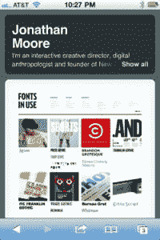

# Tumblr 重新设计默认移动布局，专注于分享和图片 

> 原文：<https://web.archive.org/web/https://techcrunch.com/2012/09/05/tumblr-redesigns-default-mobile-layout-to-focus-on-sharing-and-images/>

# Tumblr 重新设计了默认的移动布局，专注于分享和图片

Tumblr 今天公布了一个新的、有望改进的[设计，用于移动设备博客渲染的默认处理](https://web.archive.org/web/20221208014059/http://staff.tumblr.com/post/30947043024/new-mobile-theme)。这是一个干净的布局，可以给主页带来喜欢和重新写博客，以及通过脸书、推特和电子邮件分享。移动网站现在也支持页面，Tumblr 在主 feed 之外的“关于我”等内容的永久位置，以及博客世界和移动网络的两个宠儿，无限滚动和全幅图像。

这些变化很小，但它们无疑给 Tumblr 有点过时的手机设计带来了焕然一新的外观(如下图)。该网站增加的更容易访问的分享和重新写博客功能也是 Tumblr 业务的核心，因为它实际上是如何使用的，所以在受众不断增长的移动平台上引入这些功能才有意义。

 当然，Tumblr 仍然提供上传你的[自定义移动主题](https://web.archive.org/web/20221208014059/http://www.tumblr.com/docs/en/custom_themes#iphone-themes)的选项，但很高兴看到一个更干净、更现代的默认拍摄可用，更好地适应脸书、Google+和其他人最近强调视觉内容的重新设计。