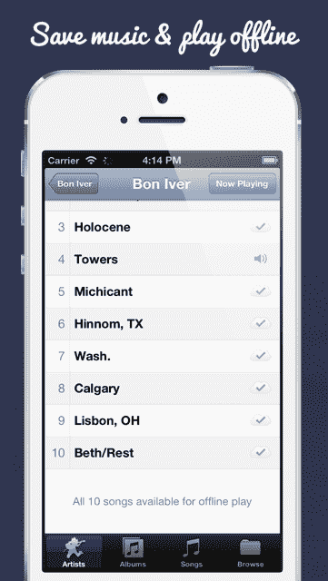

# Tunebox 是一款类似 iTunes Match 的应用程序，适用于 Dropbox 音乐文件 

> 原文：<https://web.archive.org/web/https://techcrunch.com/2013/06/13/tunebox-is-an-itunes-match-like-app-for-dropbox-music-files/>

# Tunebox 是一个类似 iTunes Match 的应用程序，用于 Dropbox 音乐文件

当 [Dropbox 去年年底收购 Audiogalaxy](https://web.archive.org/web/20221208175010/https://beta.techcrunch.com/2012/12/13/with-audiogalaxy-acquisition-dropbox-signals-its-cloud-music-ambitions/) 时，[行业观察人士](https://web.archive.org/web/20221208175010/http://evolver.fm/2013/01/18/what-is-dropbox-doing-with-audiogalaxy-anyway/)怀疑这家云音乐播放器初创公司是否能转变为一种新的音频流媒体产品。但 Audiogalaxy 很快就被关闭了，据传该团队正在开发其他 Dropbox 项目。

因此，为 Dropbox 用户提供无数字版权管理音乐文件的应用程序出现了一个[的大利基](https://web.archive.org/web/20221208175010/http://www.reddit.com/r/iphone/comments/17pf96/audiogalaxy_is_officially_gone_what_are_your/)。DropTunes 有一个广受好评的网络播放器，但移动是大多数人的主要使用案例，而 Tunebox 在 iOS 可用的八个左右的应用程序中脱颖而出。自 2011 年底推出以来，它已经自动播放歌曲，而不是像大多数其他人一样需要你从 Dropbox 下载文件到手机上。

新的 2.0 版本完成了开发者 Phil Kast 为 Dropbox 用户提供 iTunes Match 类型服务的目标，现在你可以将文件保存到你的设备上，并在离线模式下播放。只需轻按歌曲或专辑旁边的图标即可保存它，如果您想释放设备上的存储空间，轻扫即可移除它。

Tunebox 在整理 Dropbox 中的歌曲元数据以组织界面中的文件方面已经做得相当好了。但是如果你有超过两千首歌曲，它就很难显示所有的内容。现在，它通过首先对专辑进行分类来解决这个问题，即使你有数万个想要听的文件，你也可以看到你的收藏(受这个 [Lifehacker](https://web.archive.org/web/20221208175010/http://lifehacker.com/5715126/how-to-sync-itunes-across-all-your-computers-with-dropbox) 修复的启发)。

当然，任何人只要在 Dropbox 上收藏了大量不受 DRM 保护的音乐文件，就可以将它们转储到 iTunes、亚马逊或谷歌音乐产品中，以便随时随地播放。但根据他们最近发布的产品和这些天最受用户欢迎的东西，这些大型科技公司似乎更专注于流媒体和互联网广播。

他们或 Dropbox 仍然可以决定更多地关注面向无 DRM 用户的云音乐播放器，但目前 Dropbox 用户看起来像一潭死水 Tunebox 等应用程序可以收取 4.99 美元的费用，获得更多功能和更好的体验。

Kast 是我的私人朋友，但当然我在这个应用程序中没有经济利益，事实上我大部分时间都花在 Spotify 和 Pandora 上。