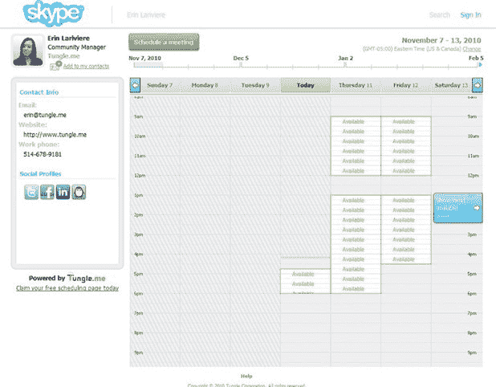

# Tungle Goes Pro 为日程安排应用程序添加品牌功能 TechCrunch

> 原文：<https://web.archive.org/web/http://techcrunch.com/2010/11/15/tungle-goes-pro-adds-branding-features-to-scheduling-application/>

# Tungle Goes Pro 向日程安排应用程序添加品牌功能

[Tungle](https://web.archive.org/web/20230204141409/http://www.tungle.me/Home/) ，一个日程安排和日历共享工具，正在添加它今天的第一个高级付费功能——品牌频道。 [Tungle.me，](https://web.archive.org/web/20230204141409/https://techcrunch.com/2009/06/01/tungleme-makes-scheduling-and-calendar-sharing-more-social/)我们之前已经在这里写过[，](https://web.archive.org/web/20230204141409/https://techcrunch.com/2010/05/04/tungle-adds-enhanced-search-user-directory-and-group-meetings-to-scheduling-application/)为用户提供了一个免费的基于网络的应用程序，让你可以跨公司和平台共享日历，安排与公司内外的个人或团体的会议，并在邀请函中提议多个会议时间。该服务目前与许多日历应用程序同步，包括 Outlook、谷歌日历和苹果 iCal。

用户现在可以选择升级到 premium 帐户，以便能够使用他们的徽标和公司颜色来标记公共页面和电子邮件邀请，并在其会议邀请中输入多达 10 个建议的位置。

这是这家初创公司的第一个付费项目；Tungle.me 已经对用户完全免费。个性化功能每月 4.99 美元，每年 49.99 美元。该公司表示，将继续增加更多优质功能，但将保持基本应用程序免费。

自 Tungle 于 2009 年推出以来，该公司的日程安排服务现已被全球 800 所大学、40%的财富 1000 强公司和 150 多个国家的用户所使用。

点击这里查看汤格尔在“未来日历”上的宣言。