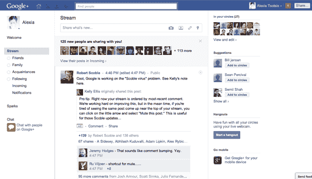
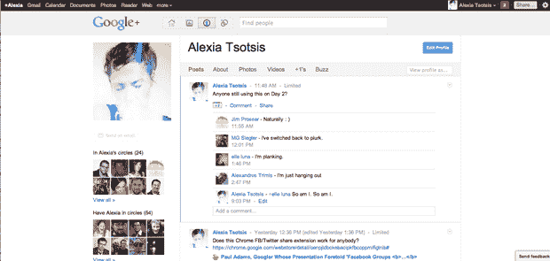

# 将 Google+变成脸书 TechCrunch

> 原文：<https://web.archive.org/web/https://techcrunch.com/2011/06/30/turn-google-into-facebook/>

# 把 Google+变成脸书

社交网络战争已经在本周[达到了 11 点](https://web.archive.org/web/20230203104212/https://techcrunch.com/2011/06/28/google-plus/)，谷歌在周二向全世界发布了备受期待(也高度泄露)的 Google+社交计划——老实说，反响不错。所以毫不奇怪，今天脸书用自己的[“我们有一些很棒的东西”](https://web.archive.org/web/20230203104212/http://www.reuters.com/article/2011/06/30/us-facebook-idUSTRE75T55S20110630)回应了+的喧嚣，发布会计划在下周举行。你们这些疯孩子！

这两个社交网络之间的相似之处是不可思议的——我的看法是，Google+就像脸书一样，拥有更易用、更精简的照片和群组界面(这可能足以赢得胜利)。只有时间能证明一切。

与此同时，对于那些有明显的中产阶级社交网络疲劳问题的人来说，有一个解决方案。感谢人类无限的创造力，你现在可以让你的 Google+看起来像脸书，用 [Google+:脸书](https://web.archive.org/web/20230203104212/http://userstyles.org/styles/50051/google-facebook) [时髦的](https://web.archive.org/web/20230203104212/http://userstyles.org/stylish/)扩展或者这个 [CSS 代码](https://web.archive.org/web/20230203104212/https://github.com/fabiogiolito/googleplusfacebook)。

我喜欢这个。

