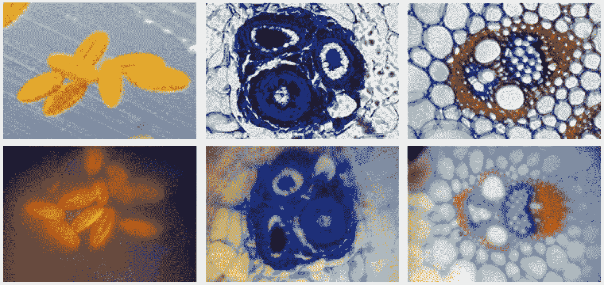

# 以不到 50 美元的价格将 iPhone 变成 350 倍医用显微镜 

> 原文：<https://web.archive.org/web/https://techcrunch.com/2011/10/07/turning-the-iphone-into-a-350x-medical-microscope-for-under-50/>

# 以不到 50 美元的价格将 iPhone 变成 350 倍的医用显微镜

将 iPhone(或任何移动智能手机或平板设备)用于医疗目的并不是一件新鲜事，但很高兴看到人们发明的应用程序。就在最近的 Disrupt 上，我们看到了 [Smartheart](https://web.archive.org/web/20230205023936/https://techcrunch.com/2011/05/24/smartheart-turns-your-mobile-phone-into-a-heart-monitor/) ，像 [Skin Scan](https://web.archive.org/web/20230205023936/http://eu.beta.techcrunch.com/2011/06/27/check-your-skin-for-a-melanoma-yes-theres-an-app-for-that-too/) 这样的应用正在分散一些简单的自我监控任务，如黑色素瘤检测。

我们还看到了 iPhone 摄像头的许多物理附件。你可以得到广角镜头、长焦镜头，甚至一个 [12x 显微镜镜头](https://web.archive.org/web/20230205023936/https://techcrunch.com/2010/09/06/got-10-bucks-and-5-minutes-turn-your-iphone-4-into-a-12x-microscope/)。但是加州大学戴维斯分校的一组研究人员以很低的成本将 iPhone 制成了 350 倍的显微镜，从而超越了竞争对手。现在你可以向人们发送你血细胞的 Instagrams。

应该马上说，这不是只有 iPhone 才能做的事情。但出于显而易见的原因，它是这类概念验证的首选设备。该技术以后可以推广到其他设备。

该项目实际上是一个相当简单的小黑客。他们使用 1 毫米的球形镜头，并用橡胶片和一些胶带将其贴在 iPhone 镜头阵列的外部。这个小镜头从技术上来说只能放大 5 倍，但它聚焦的方式产生了一个微小的对焦区域，可以分辨大约 1.5 微米的细节。视野非常小，需要处理失真，但是通过组合几张照片的焦点区域，您可以获得足够清晰的图像来识别细胞类型，进行计数，甚至进行光谱读取。

看看这些图片:上面的是用全功能商业医用显微镜拍摄的，下面的是用 iPhone 拍摄的:

质量上显然有很大的差别，但价格上的差别更大，而且高质量的显微镜不太容易移动。

本质上这是迈向三录仪的又一步。凭借通用 CPU、模块化输入和多功能成像单元，智能手机的用途远不止打电话给朋友和玩愤怒的小鸟。这可能不是一个移动诊所，但在那些很难获得资金和电力的地区，iPhone 可能是一个有价值的诊断工具。通过廉价的组件和额外的工作来扩展我们设备的“感官”可以极大地增强分散式医疗保健的能力。

[你可以在这里阅读全文](https://web.archive.org/web/20230205023936/http://www.plosone.org/article/info%3Adoi%2F10.1371%2Fjournal.pone.0017150#pone-0017150-g001)。这项研究的资金是由国家科学基金会提供的。