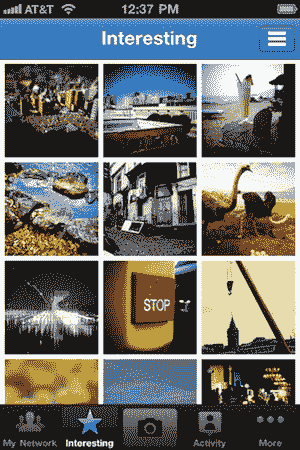

# Mac 版 Twitter 的惊人隐藏小功能:在任何地方发任何消息 TechCrunch

> 原文：<https://web.archive.org/web/https://techcrunch.com/2011/01/14/tweet-from-os-x/>

# Mac 版推特的惊人隐藏小功能:在任何地方发任何东西

我喜欢 Mac 版的 Twitter。爱死了。它完全改变了我的日常工作流程。它改变了 T4 使用推特的方式。那是在我发现这个杀手级的隐藏功能之前:在任何地方发微博。

我不知道我以前是怎么错过的，但显然为 Mac 安装 Twitter 为 OS X 中运行的大量应用程序添加了一个新的“Tweet”命令。

例如，如果你在 Safari 或 Chrome 浏览器中浏览网页，高亮显示一个单词或段落并点击右键。在下拉列表的底部，你会看到“Tweet”命令。点击它将为您填充一条带有突出显示部分的推文。它可以在“文本编辑”、“iChat”、“日历”、“邮件”等中使用。如果你看了，你可以发微博。

我希望它能在网页浏览器中自动添加一个链接和高亮显示的文字，但是要循序渐进。我有预感会到来。

是的，很多插件已经拥有这种能力有一段时间了，但是现在它是全系统的。就好像 Twitter 现在被烤成 OS X 一样。

