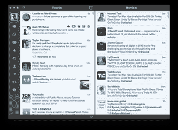

# Tweetbot 现已上市，售价 19.99 美元:推特客户端令牌限制导致了高价

> 原文：<https://web.archive.org/web/https://techcrunch.com/2012/10/18/tweetbot-mac-twitter-osx-mac-app-store/>

# Tweetbot 现在售价为 19.99 美元:推特客户端令牌限制导致了高价

[经过长期的公开α和β测试阶段后，苹果公司的推特机器人](https://web.archive.org/web/20230213113619/http://tapbots.com/software/tweetbot/mac/)终于以零售形式发布了。著名的 iOS 和 Mac 开发者 Tapbots 的 OS X 本地推特客户端可从 [Mac 应用商店](https://web.archive.org/web/20230213113619/https://itunes.apple.com/us/app/tweetbot-for-twitter/id557168941?ls=1&mt=12)购买，价格令人瞠目结舌，达到 19.99 美元。它值 20 美元吗？一千次是的。但是不熟悉 Tapbots 工作的用户可能会不愿为这种应用支付那么多钱——这正是 Tapbots 所指望的。

当我问 Tapbots 的联合创始人保罗·阿达德定价时，他说这是故意高于公司最初的预期，主要是由于[推特新的应用编程接口令牌限制](https://web.archive.org/web/20230213113619/https://techcrunch.com/2012/10/03/tapbots-founder-paul-haddad-on-app-net-netbot-and-what-twitters-new-api-means-for-tweetbot/ "Tapbots Founder Paul Haddad On App.net, Netbot, And What Twitter’s New API Means For Tweetbot")，这限制了苹果客户端的推特机器人能够支持的最大用户数量。这个限制是与推特机器人对 iOS 的限制分开确定的，因此只能容纳更少的用户。一旦代币消失，Tapbots 将不再能够销售 Tweetbot，所以从这个意义上说，这是一个非常真实的、非营销意义上的限量版软件。

Tapbots 花了大量的时间和精力为 Mac 创建 Tweetbot，他们打算在不得不停止销售后很长一段时间内继续支持它，因此价格会更高。因此，尽管对那些新加入 Tapbots 和 Tweetbot 的人来说，价格标签可能令人望而生畏，但专用用户会非常愿意支付，我不认为供应会持续那么长时间。

 与此同时，Tapbots 希望用户[撤销旧版 Tweetbot](https://web.archive.org/web/20230213113619/https://twitter.com/settings/applications) 上的代币，如果他们不打算使用的话，还希望[联系 Twitter](https://web.archive.org/web/20230213113619/https://twitter.com/support) 并鼓励他们建议提高代币限额。我有点怀疑第二种方法会对社交网络的政策变化产生如此大的影响，但试试也无妨。

如果你没有像我一样在 Tweetbot 发布后使用过它的 alpha 和 beta 版本，我只能说它太棒了。自从 Tweetie 被 Twitter 收购后，我一直在寻找一个合适的替代者，但没有什么能与 Tweetbot 相提并论。这是我早上启动的第一个应用程序，也是我晚上关机时关闭的最后一个应用程序。它有实时流媒体，可定制的栏目，静音功能和其他一系列令人敬畏的东西。此外，它拥有周围最好看的设计。即使是 20 美元要价的两倍，Tweetbot 也是显而易见的。