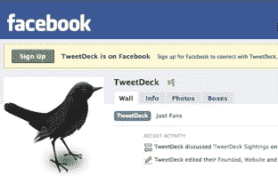

# TweetDeck 加入脸书连接大军

> 原文：<https://web.archive.org/web/https://techcrunch.com/2009/03/16/tweetdeck-joins-the-facebook-connect-army/>

# TweetDeck 加入脸书连接大军

你现在可以将 [TweetDeck](https://web.archive.org/web/20230331020801/http://www.tweetdeck.com/beta/) 添加到加入脸书连接的应用程序大军中。TweetDeck 是 Twitter 最受欢迎的桌面客户端，现在它也将增加脸书功能。当你从 TweetDeck 发送一条消息时，你现在可以选择将它发送到 Twitter 和/或脸书。TweetDeck 中将添加一个新栏，向您显示您的脸书朋友的状态更新(除了您在 Twitter 上关注的人的现有栏、回复和直接消息之外)。如果你的一个脸书朋友在线，他们的名字旁边会出现一个绿点，你可以通过弹出窗口用脸书聊天工具和他们聊天。

TweetDeck 将在未来几天推出新功能。对于那些想要手动升级的人来说，更新的版本将在这里[发布](https://web.archive.org/web/20230331020801/http://tweetdeck.posterous.com/)。

TweetDeck 只是加入脸书连接大军的最新应用。周六，脸书宣布[脸书连接现在可以与 iPhone 应用](https://web.archive.org/web/20230331020801/https://techcrunch.com/2009/03/14/facebooks-dave-morin-on-the-search-for-a-more-social-web/)和桌面应用[如 Seesmic](https://web.archive.org/web/20230331020801/http://www.loiclemeur.com/english/2009/03/seesmic-launches-the-first-facebook-desktop-client-available-today.html) 一起使用。通过 Tweetdeck，脸书进入了 Twitter 应用领域。通过追逐 Twitter 应用，脸书可以绕过 Twitter 做最后一搏。仅 Tweetdeck 就占了所有 Twitter 用户的 13%。

如果更多的顶级 Twitter 应用加入脸书连接，超过三分之一的 Twitter 用户将很快被覆盖。当然，Twitter 本身可以增加一个脸书连接选项，但这将是脸书的胜利。

