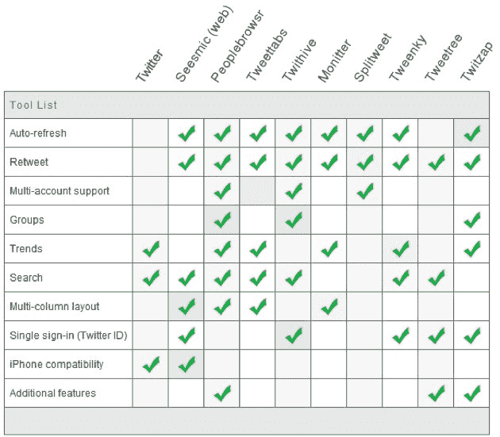
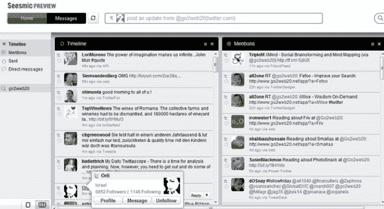
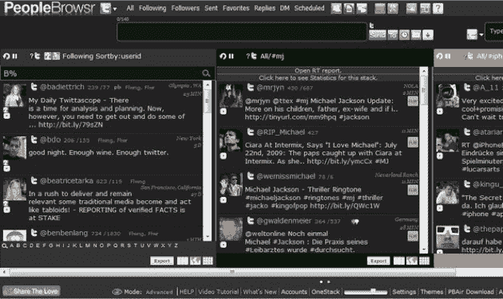
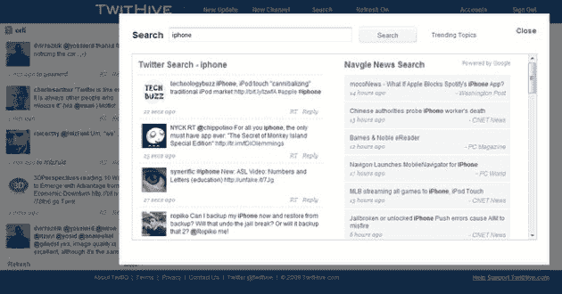
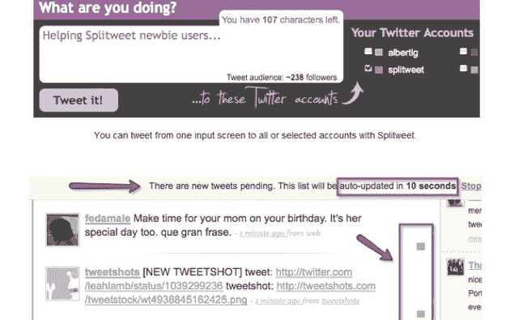
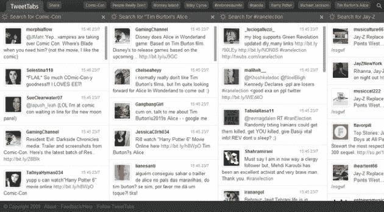
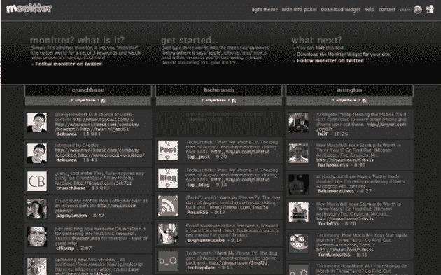
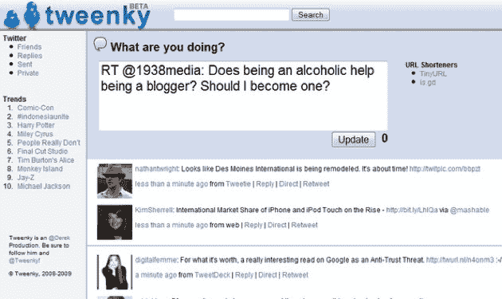
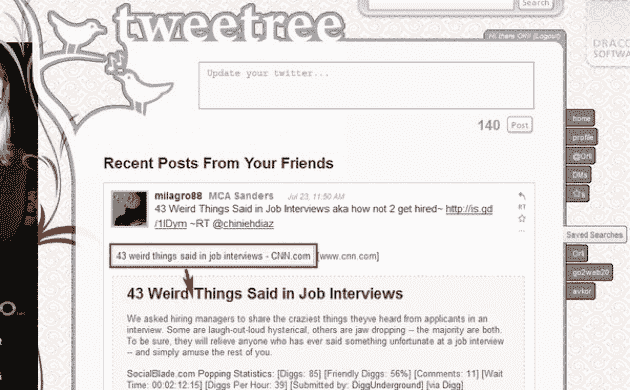
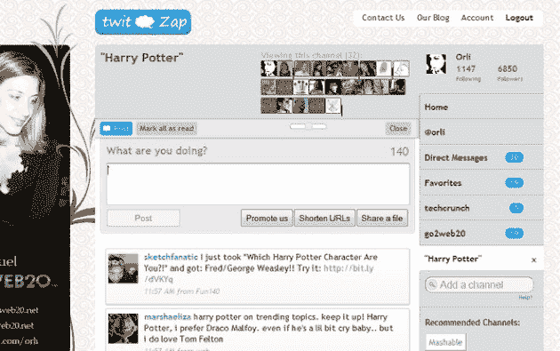

# 从网上发微博？九种不同的网络客户端

> 原文：<https://web.archive.org/web/https://techcrunch.com/2009/07/25/tweeting-from-the-web-nine-alternative-web-clients/>

*这是以色列博主[奥利·雅库勒](https://web.archive.org/web/20230327002745/http://www.crunchbase.com/person/orli-yakuel)的客座博文，他显然花了大量时间测试每一种访问 Twitter 的方式。在这篇文章中，她分享了她在 Twitter 服务中最喜欢的九个网络界面的体验(我们还有一个我们喜欢的界面，一周前刚刚推出的 [tunein](https://web.archive.org/web/20230327002745/http://tunein.com/) )。第十名当然是 Twitter.com——但是酷孩子总是想与众不同。你可以在 Orli 的博客上了解更多信息。*

信不信由你，[几乎 50%的](https://web.archive.org/web/20230327002745/http://blog.hubspot.com/blog/tabid/6307/bid/4584/New-Data-on-Top-Twitter-Applications-and-Usage.aspx) [Twitter](https://web.archive.org/web/20230327002745/http://www.crunchbase.com/company/twitter) 用户更喜欢直接从 Twitter.com 发微博。这并不奇怪，但大多数 Twitter 重度用户都认为，在众多可供选择的网络应用程序中，Twitter.com 实际上是用户体验最差的。但是 Twitter.com 有一个优点(除了它是所有新用户访问 Twitter 的默认方式)——简单易用。

但在使用 Twitter 几个月后，你开始寻找转发按钮、自动刷新更新或创建群组的方式，此外，你正在寻找一种更好的方式来浏览你无尽的朋友列表和/或内容。你不会在 Twitter 上找到这些功能(虽然 [Power Twitter](https://web.archive.org/web/20230327002745/https://techcrunch.com/2009/01/03/power-twitter-for-firefox-inline-media-integrated-search-and-a-lot-more/) 插件可以让你大部分时间都在 Twitter 上)，但这里有一个替代的网络应用程序列表，可以让你通过浏览器以比 Twitter 网站本身更丰富的方式监控你的 Twitter 账户。

有了 [Web Seesmic](https://web.archive.org/web/20230327002745/http://seesmic.com/web) (披露:阿灵顿在 Seesmic 上仍有少量投资)，你可以在一个地方实时监控你所有的推文活动。轻松浏览您的朋友列表，选择您最喜欢的布局，等等-所有这些都来自一个非常干净清晰的界面。到目前为止，我发现 Web Seesmic 最有可能成为你的下一个 Twitterstream 服务。当然，仍有改进的余地。说到可用性，这个设计太简约了。转发/直接消息应该是可视化的，只需点击一下即可访问。“列表视图”导航比列好，但是字体太小了(需要尽快改变)。此外，它缺少两个重要的功能:趋势列表，如果你想了解及时的新闻和时事，这变得非常重要，以及 twitpic/yfrog 集成。惊讶之余，不得不问:Seesmic 做得这么好的主要在哪里？基于视频的评论对这款应用的影响至少要大十倍。他们已经完全放弃视频了吗？

同时 [PeopleBrowsr](https://web.archive.org/web/20230327002745/http://my.peoplebrowsr.com/) 拥有一切。查看您的所有 tweetstream、您的提及、DMs、基于搜索的关键字、创建群组、从一个仪表板管理多个帐户、使用带有快速标签的待办事项列表、与您的所有社交网络集成、RSS 导入、地图视图和大量其他功能。问题是——这太让人受不了了！即使是 Twitter 上最熟练的超级用户也不需要所有这些高级功能。幸运的是，PeopleBrowsr 有一个简单的版本，使用起来更合理。尽管如此，在高级版和轻量版中，我确实感到有些失落。

PeopleBrowsr 提供了许多其他服务，这些服务与您在网上的所有社交活动都相关。这项服务实际上让我想起了 Zoho，它是网络上最大的办公套件。也许这就是 PeopleBrowsr 走向的方向？–所有实时活动的一站式商店。

TwitHive 是 Twitter 的一个多渠道网络仪表板。该服务允许您根据自己的查询创建频道。你可以随意定制每个频道。总体上听起来可能很棒，但在实际测试中，这项服务并没有给我留下深刻印象。该服务使用起来有些烦人——搜索和新更新在不同的层打开，创建专栏需要时间，而其他服务会自动为你完成。有一件事我很喜欢，也觉得很独特，那就是将谷歌新闻和博客搜索与你执行的任何搜索结合在一起。

如果你有几个 Twitter 账户需要监控(个人加品牌)，你可以考虑使用 [Splitweet](https://web.archive.org/web/20230327002745/http://splitweet.com/) 。Splitweet 允许你创建一个账户列表，并向多个账户发布推文。您还可以从所有管理的帐户关注您的联系人的推文。好吧，这是我对这项服务的问题:每个账户都有自己的颜色，Splitweet 将这个彩色编码框放在信息流中每条推文的旁边。我个人认为用颜色来指代不同的 Twitter 账户有点奇怪。我宁愿看到账户的用户名，或者一个小图标，而不是记住那个账户的颜色。

Tweetmeme 项目 TweetTabs 是追踪 Twitter 趋势的最简单方法。它是如此简单，你真的不需要做任何事情。只要进入这个网站，享受 Twitter 上呈现的每一个潮流趋势。此外，您可以运行关键字搜索，它会自动将其添加为一个新列。没有任何注册，如果你想回复或转发别人的推文，你会被重定向到你自己的 Twitter 个人资料(我发现这总是非常有用)。虽然在 TweetTabs 上，除了我上面提到的，你看不到你朋友的流，也不能管理其他任何东西。

与 TweetTabs 类似， [Monitter](https://web.archive.org/web/20230327002745/http://monitter.com/) 允许你在 Twitter 上追踪对你最重要的事情，而无需注册或登录。只需在三个搜索框中键入三个词(如果需要，你可以自由添加更多的搜索框)，几秒钟内你就会开始看到相关的推文直播。Monitter 提供的一个东西比这里列出的所有其他东西都重要，那就是能够为您的网站获取实时 twitter 流小部件，并可以选择定制 CSS，使其看起来像您想要的样子。

Tweenky 作为第一个实现网络实时推特的服务，值得称赞。可惜没有进一步进化。他们的第一个版本有这种[漂亮的 Gmail 外观&感觉](https://web.archive.org/web/20230327002745/https://techcrunch.com/2008/07/24/tweenky-brings-gmails-good-looks-to-twitter/)，但出于某种原因，今天，它看起来只是相当普通和无聊。说到这里，你可能会因为它的简单而想要使用它。Tweenky 的设计对用户来说非常明显。活动和趋势的列表总是可访问的，并且主流很容易适应。我发现更新框中较大的字体非常有用。

[还记得围绕](https://web.archive.org/web/20230327002745/https://techcrunch.com/2008/12/28/actual-conversations-on-twitter-not-possible-until-twitter-lets-us/) [Tweetree](https://web.archive.org/web/20230327002745/http://tweetree.com/) 的所有议论吗？我今天又试了一次，惊讶地发现什么都没有改变(通常随着时间的推移，你会看到更多有用的功能，不是吗？).无论如何，如果你想看到你的流的更大的图片，它仍然是一个很好的服务。Tweetree 嵌入了外部内容，因此你可以在 twitterstream 上看到图片、视频，甚至是已提交链接的文本。老实说，我不喜欢这项服务超越 Twitter 布局的方式。如果你已经在后台使用 Twitter 了，那就少用你的标识。在 Tweetree 的例子中，他们在 twitter 页面上放置了两个非常大的标志，这只是为了分散注意力。如果没有那些嘈杂的设计，获得所有的功能就不会那么烦人了。

TwitZap 对于一个位于 Twitter 网站之上的层来说还不错，坦白地说，它有其他人没有的很棒的工具。首先，它可以让你组织你最喜欢的频道，然后它会告诉你当你不在频道上时，你错过了多少更新，这与 RSS 阅读器的体验有关。但是更进一步，它显示了谁是现在正在观看同一频道的人，这是目前为止根据一个共享的活动找到人的最好方法。页面实时刷新(你甚至可以选择它的速度)，在它的浏览器标签上，你可以看到你错过了多少条新推文。底线是，如果我必须在这 9 个服务中选择最好的，我认为 TwitZap 是赢家(他们应该把注册改为单点登录)。

坦率地说，我对所有这些服务都不完全满意。我认为与桌面客户端相比，Twitter 网络客户端比较弱。我想知道谁会站出来把整个经历向前推进。谁会把 twitpic、 [blip.fm](https://web.archive.org/web/20230327002745/http://blip.fm/) 、表情符号、视频以及我们在其他 Twitter 应用上发现的所有有趣的东西整合成一个呢？我们知道的一件事是——它最有可能不是 Twitter。因此，需要其他人将所有内容收集到一个简单易用的页面中。我还在寻找那一项服务…