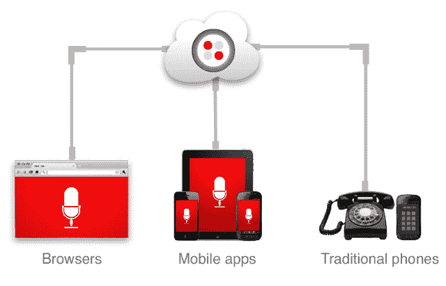

# Twilio Client 允许开发人员将 VoIP 呼叫集成到任何应用程序中 

> 原文：<https://web.archive.org/web/http://techcrunch.com/2011/07/26/twilio-client-lets-developers-integrate-voip-calling-into-any-application/>

Twilio 是一家致力于帮助开发者将电话技术融入他们的应用程序的公司，该公司今天上午推出了一项新功能，这很可能会催生一批创业公司(或者至少是现有网络和移动应用程序中的一系列新功能)。

简而言之，它让开发人员将 VoIP 灵活且经济高效的功能整合到他们自己的应用程序中，这是 Skype 和 Google Voice 等服务使用的一种技术。它还为开发人员省去构建处理 VoIP 服务所需的基础设施的麻烦。见见 Twilio 客户。

在高层次上，Twilio Client 可能最好被描述为一个促进嵌入式 VoIP 通信的平台，但这令人困惑，并且没有真正演示它到底做什么。所以我们来试几个例子。

假设你有一个社交网络(我会选择 LinkedIn ),它想让用户发起与其他用户的语音通话，但不要求任何一方实际交出他们的电话号码或即时消息句柄。有了 Twilio Client，LinkedIn 可以实现这一功能:你可以点击一个朋友网名旁边的按钮，对方会看到一个弹出窗口，询问他们是否想和你通话，电话会通过 Twilio 的 VoIP 管道转接。Skype 或许可以提供同样的功能，但这需要一种特殊的合作关系——有了 Twilio，任何应用程序都可以实现这一功能。

另一个例子:除了网页版(从今天开始对所有人开放)，Twilio 还推出了 Android 和 iPhone 的移动版 Twilio 客户端。这意味着移动开发者将能够在他们的应用程序中包含语音呼叫功能，而不需要用户交换电话号码。显然，这对于偏好匿名的服务(比如约会应用)来说非常好，但许多其他应用也可以受益于语音通话:市场、社交网络，甚至游戏。

显然这将给 Skype 带来一些竞争。不，Twilio 本身不会很快推出 Skype 的直接竞争对手，但它会给开发者提供工具来复制 Skype 的大部分语音相关技术。早在 2008 年，劳森[告诉我](https://web.archive.org/web/20230204233225/https://techcrunch.com/2008/11/20/twilio-powerful-api-for-phone-services-that-can-recreate-grandcentral-in-15-lines-of-code/) Twilio 可以用 15 行代码重建 GrandCentral(现在的谷歌语音)。他说，在这次发布中，你可以用下面三行代码复制 Skype。显然这有点夸张，但重点仍然是:现在开发者可以模仿 Skype Voice 的基本功能，这意味着他们可以专注于这些核心功能之外的创新。

当然，这大部分都不是免费的。Twilio 对纯 VoIP 呼叫的收费是每分钟 1/4 美分，从 VoIP 客户端路由到普通电话线的呼叫是每分钟 2 美分(换句话说，开发者有强烈的动机推动用户进行基于 VoIP 的呼叫)。

我们应该注意到，Twilio Client 提供的服务并不完全是独一无二的——例如，Jajah 已经在网站和移动应用程序上集成了 VoIP。但劳森说，这些通常是与大公司的一次性交易，而不是任何人都可以访问的 API。同样，Skype 的 [SkypeKit](https://web.archive.org/web/20230204233225/https://developer.skype.com/public/skypekit) 允许开发者将 Skype 功能植入他们的产品，但它主要针对消费电子设备。

Twilio 客户可能是件大事。Twilio 的 SMS API 引发了一波群发短信的创业浪潮，如果我们在未来六个月内看到这一 API 的大量创新，我不会感到惊讶(他们将在 9 月 21 日和 22 日举行的 Twilio [会议](https://web.archive.org/web/20230204233225/http://twilio.com/conference)上帮助启动下一波浪潮)。

