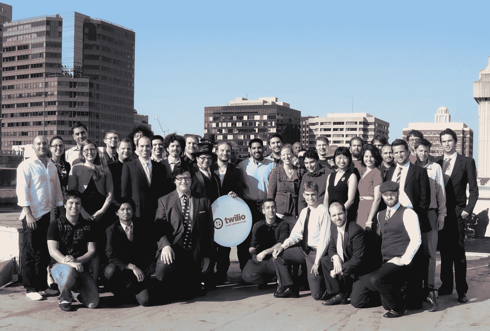

# Twilio 从 Bessemer 和 Union Square 获得 1700 万美元的 C 轮融资，用于海外扩张 TechCrunch

> 原文：<https://web.archive.org/web/https://techcrunch.com/2011/12/07/twilio-series-c/>

# Twilio 从 Bessemer 和 Union Square 筹集了 1700 万美元的 C 轮融资，用于海外扩张

云通信先驱 Twilio 凭借 API 在美国占据主导地位，该 API 允许开发人员为应用程序添加短信、语音和 VoIP 功能。现在，它计划利用 1700 万美元的 C 轮融资，将服务扩展到另外 20 个欧洲国家。投资来自 Bessemer Venture Partners 和 Union Square Ventures，这两家公司一年前都参与了其[B 轮](https://web.archive.org/web/20221210023422/https://beta.techcrunch.com/2010/11/09/twilio-raises-12-million-for-powerful-telephony-api/)，并为 [Twilio 带来了总计 3370 万美元](https://web.archive.org/web/20221210023422/http://www.crunchbase.com/company/twilio)的资金。

当我问资金具体流向哪里时，首席执行官兼联合创始人杰夫·劳森回答说:“建立销售团队，建立营销团队，生产产品，雇佣更多的工程师。我们的主要增长领域是国际市场。我们在英国，将在接下来的几个月里推广到欧洲其他地区。”

显然，选择与 Bessemer Venture Partners 合作很容易。劳森告诉我“董事会做出决定(让 Twilio 进行 C 轮融资)，Bessemer 立即转身给了我们一份非常有说服力的条款清单。他们让我专注于建设公司，而不是资金。”Bessemer 的 Byron Deeter 和 Union Square 的 Albert Wenger 仍然留在 Twilio 的董事会，Lawson 说他们“以良好的方式积极参与公司事务，帮助招聘和制定战略。”

这笔资金将帮助 Twilio 在经历了巨大的一年后保持势头，并继续积极招聘。这家总部位于旧金山的公司在 2011 年从 25 名员工增长到近 100 名，其客户群增长了 400%，达到 75，000 名开发人员。它推出了 [Twilio Client](https://web.archive.org/web/20221210023422/https://beta.techcrunch.com/2011/07/26/twilio-client-lets-developers-integrate-voip-calling-into-any-application/) ，允许开发人员将云通信功能集成到任何应用程序中，还推出了 [Twilio Connect](https://web.archive.org/web/20221210023422/https://beta.techcrunch.com/2011/09/21/twilio-connect-makes-charging-for-twilio-powered-apps-less-complicated/) ，这样开发人员就可以让 Twilio 直接向他们的客户或最终用户收取功能使用费用。

10 月，它将其服务带到了英国，这样本地和美国的开发者就可以获得英国的电话号码。有了这笔资金，它将扩展到法国、瑞典、瑞士、意大利和大多数其他主要欧洲国家，尽管德国和爱尔兰明显缺席。这一举措回应了 Twilio 的顶级客户对接触国际观众能力的要求。

劳森告诉我，Twilio 的最终目标是“打开电信的黑匣子，让世界远离思科和微软昂贵的大[硬件]遗产，你把它们放在你的衣柜里，看着时代。我们正在彻底改造云，每次部署代码都会变得更好。”有了周密的全球统治计划和资金支持，任何人都很难赶上 Twilio。

【T2