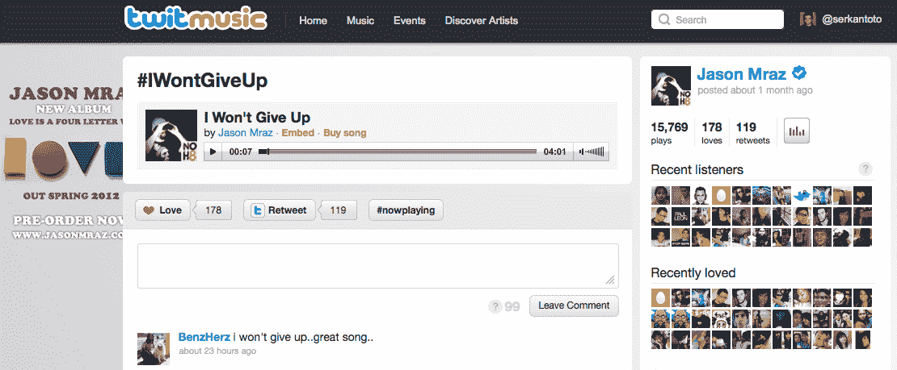

# 总部位于马尼拉的社交音乐服务 Twitmusic 跻身 500 家初创企业 

> 原文：<https://web.archive.org/web/http://techcrunch.com/2012/04/16/twitmusic-500-startups/>

拥有 9200 万人口的巨大国内市场，英语是官方语言，庞大的 IT 人才库，以及在东南亚的战略位置:菲律宾肯定有潜力成为亚洲的下一个[网络](https://web.archive.org/web/20230209124957/https://techcrunch.com/2010/05/27/what-the-hell-is-going-on-in-indonesia/) [发电站](https://web.archive.org/web/20230209124957/https://techcrunch.com/2010/06/06/is-%E2%80%9Cremarkable-indonesia%E2%80%9D-the-new-%E2%80%9Cincredible-india%E2%80%9D-for-investors/)。我上个月去了一趟中国(私人旅行),意识到初创企业仍处于起步阶段，但这种情况很快就会改变。

一家来自菲律宾的开创性初创公司是 [Twitmusic](https://web.archive.org/web/20230209124957/http://twitmusic.com/) ，这是一家基于 Twitter 的社交音乐服务，面向艺术家及其粉丝。作为一名艺术家，在 Twitter 上拥有一个账户是一回事，但 Twitmusic 允许他们在几分钟内通过 Twitter 上传和分享歌曲(和其他内容)。

现有的 Twitter 用户可以登录，对歌曲发表评论，“喜欢”它们，转发它们，或者使用#nowplaying 标签一键与粉丝分享链接。用户也可以在其他地方嵌入歌曲，下载歌曲(这里的[是一个非常流行的可下载的歌曲)，或者通过 iTunes 在 Twitmusic 上购买歌曲。](https://web.archive.org/web/20230209124957/http://twitmusic.com/songs/dozhg)

这里显而易见的想法是为艺术家提供一个更有效的病毒式推广和分销渠道，以接触、接触和销售音乐给粉丝——与 Twitter 无缝集成。用户可以在 Twitmusic 上免费听歌，发现新的曲目或艺术家，并与粉丝分享内容，而无需注册新网站。

Twitmusic 的概念似乎奏效了:MC Hammer 正在积极使用这项服务([这里](https://web.archive.org/web/20230209124957/http://twitmusic.com/artists/mc-hammer)是他的 Twitmusic 个人资料页面)，同样使用的还有[布莱恩·亚当斯](https://web.archive.org/web/20230209124957/http://www.twitmusic.com/artists/bryan-adams--3)、[保沃](https://web.archive.org/web/20230209124957/http://www.twitmusic.com/artists/bow-wow)、[乔恩·塞卡达](https://web.archive.org/web/20230209124957/http://www.twitmusic.com/artists/jon-secada)、[杰森·玛耶兹](https://web.archive.org/web/20230209124957/http://www.twitmusic.com/artists/jason-mraz)，以及目前超过[4000 名其他艺人](https://web.archive.org/web/20230209124957/http://twitmusic.com/artists)。亚当斯甚至选择在 Twitmusic 上独家发布他的最新单曲。

下面是一首歌的专用页面(在这里是杰森·玛耶兹的《我不会放弃》):

凭借最初的吸引力，这项服务背后的同名马尼拉初创公司已经引起了亚洲投资者的兴趣，但联合创始人 Stefano Fazzini 独家告诉 TechCrunch，核心团队几天前已经搬到了美国。

作为第一家来自菲律宾的公司，Twitmusic 被总部位于硅谷的加速器和资本基金 [500 家创业公司](https://web.archive.org/web/20230209124957/http://500.co/)(刚刚[又筹集了 5000 万美元](https://web.archive.org/web/20230209124957/https://techcrunch.com/2012/04/06/500-startups-new-fund-new-partners/))接纳。Twitmusic 已经成为第四批 500 家创业公司的一部分，就在该计划开始前 10 天(4 月 2 日)，Fazzini 表示演示日将在 7 月底左右举行。(他的兄弟、共同创始人克里斯蒂安·法兹尼现在也居住在美国。)

对于亚洲许多关注全球的初创公司来说，这应该是一个令人鼓舞的消息，尤其是考虑到这项服务是如此年轻:Twitmusic 于 2011 年 10 月推出。

想要了解更多关于 Twitmusic 的信息，点击[此链接](https://web.archive.org/web/20230209124957/http://thenextweb.com/twitter/2012/04/09/twitmusic-is-socializing-the-web-music-industry-using-twitter-and-top-artists/)获取最近对法兹尼和 Twitmusic 营销总监桑德拉·塞弗特的深度采访。《赫芬顿邮报》英国版在二月份报道了 Twitmusic [。](https://web.archive.org/web/20230209124957/http://www.huffingtonpost.co.uk/andrew-telling/twitmusic-welcome-to-the-new-order_b_1262781.html?ref=uk)