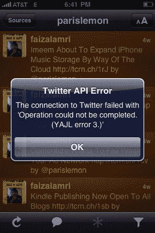

# Twitter 启示不是现在:危机已经避免。大部分是。

> 原文：<https://web.archive.org/web/https://techcrunch.com/2009/06/12/twitpocalypse-not-now-crisis-averted/>

# Twitter 启示不是现在:危机已经避免。大部分是。

所以，正当推特上的每个人都在[谈论](https://web.archive.org/web/20230403232747/http://twitter.com/timeline/search?q=Twitpocalypse)今天的事情时，一场[推特末日的可能性正在逼近我们](https://web.archive.org/web/20230403232747/https://techcrunch.com/2009/06/12/all-hell-may-break-loose-on-twitter-in-2-hours/)。[网站](https://web.archive.org/web/20230403232747/http://www.twitpocalypse.com/)跟踪某些第三方 Twitter 应用程序可能出现的故障，这些应用程序不是为处理有符号整数限制而构建的，该网站认为危机将在明天凌晨(美国)发生——但 Twitter 通过在今天触发它来预先阻止这个问题，因此所有人都将在甲板上解决这个问题。而且成功了。

Twitter 联合创始人[比兹·斯通](https://web.archive.org/web/20230403232747/http://www.crunchbase.com/person/biz-stone)告诉我们:“按照计划，我们今天下午进行了部署，避免了 Twitter 的末日。好消息。但是这个问题有一个暂时的小伤亡，我被告知 Twitter 搜索已经暂停了大约一个小时。但斯通说，这应该会很快赶上并恢复正常。

所以，现在每个人都可以冷静下来。就像大约 10 年前世界大部分地区都吓坏了的千年虫一样，推特启示录来了又去，没有出现任何问题。

更新:正如一些评论者所指出的，我也刚刚证实，受欢迎的 Twitter 应用 Twitterrific 现在因为 API 错误而完全崩溃——至少 iPhone 版本是这样。一些报道称，TweetDeck 正面临类似的问题。

。