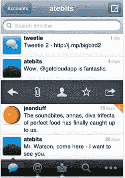

# Twitter 收购 Tweetie 

> 原文：<https://web.archive.org/web/https://techcrunch.com/2010/04/09/twitter-acquires-tweetie/>

 Twitter 刚刚[宣布](https://web.archive.org/web/20230304070016/http://blog.twitter.com/2010/04/twitter-for-iphone.html)收购了 Tweetie，这是一款非常受欢迎且高度完善的 iPhone Twitter 应用。该应用程序现在将被称为“iPhone 的 Twitter”，并将从 2.99 美元降至免费，开发人员[罗兰·布里切特](https://web.archive.org/web/20230304070016/http://www.crunchbase.com/person/loren-brichter)(一人创业公司 [Atebits](https://web.archive.org/web/20230304070016/http://www.atebits.com/) 的创始人)将加入 Twitter 移动团队。Twitter 还计划为 iPad 推出 Twitter，布里切特将参与其中。

这是一个既令人震惊又不令人意外的举动。这并不奇怪，因为 Twitter 投资者 Fred Wilson 最近[写道](https://web.archive.org/web/20230304070016/https://techcrunch.com/2010/04/07/twitter-startups-stop-filling-holes/)Twitter 开发者需要停止在 Twitter 产品中“填补漏洞”,而是建立完全独立的业务。就在今天早上，Twitter [发布了用于黑莓应用的官方 Twitter](https://web.archive.org/web/20230304070016/https://techcrunch.com/2010/04/09/twitter-fills-its-first-hole-with-an-official-blackberry-app/)，因此另一个移动应用应该不会带来太大的冲击。然而，iPhone 是一个平台，Twitter 在这个平台上有非常强大的第三方存在，Twitter 无疑受益于这些开发者的贡献。Tweetie 非常完美，可以说是最好的，但还有很多其他高质量的应用程序被晾在一边。不过，像这样的举动似乎是不可避免的。

在宣布这一消息的博客文章中，Twitter 首席执行官伊万·威廉姆斯解释了其中的逻辑:人们正在 iTunes 上搜索 Twitter 应用程序，但没有找到，所以他们放弃了(这听起来像是 iTunes 搜索的问题，但也许人们真的只是想在应用程序的标题中看到“Twitter”:

> 对 iTunes AppStore 中 Twitter 用户体验的仔细分析揭示了巨大的改进空间。人们在 Twitter 上寻找一款应用，但他们没有找到。所以，他们困惑了，放弃了。重要的是，我们要为用户利益进行优化，创造令人敬畏的体验。

这一切都发生在 Twitter 的开发者大会 Chirp 之前不到一周，我怀疑该公司将试图引导开发者走上一条他们不会很快铺平的道路。

值得注意的是:Twitter 的帖子没有提到任何关于 Tweetie 桌面应用程序的内容，该应用程序只适用于 Mac。如果这最终成为“Mac 版 Twitter ”,不要感到惊讶。