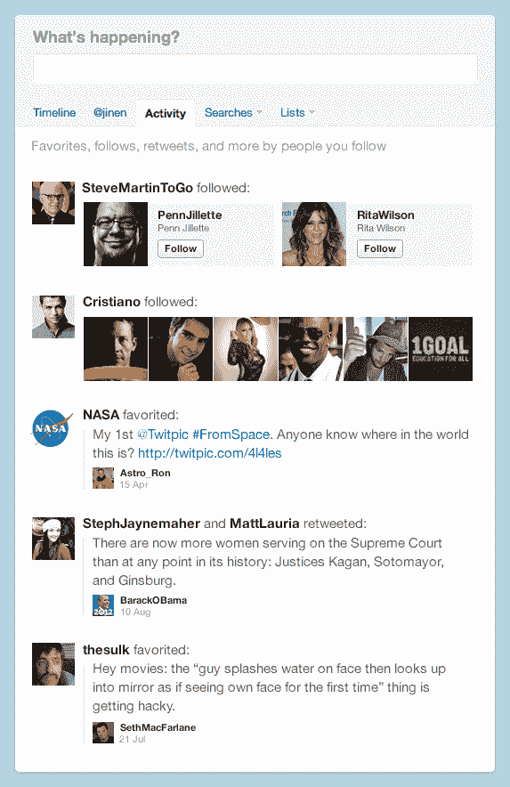

# Twitter 因实时活动流而活跃起来 TechCrunch

> 原文：<https://web.archive.org/web/https://techcrunch.com/2011/08/10/twitter-activity-streams/>

从一开始，Twitter 上的内容基本上是以同样的方式显示的。这是一个线性的，按时间倒序排列的推文流。这项服务增加的两个新部分将改变这种情况。

具体来说，twitter.com 上的“@提及”标签将被两个新标签取代:“@用户名”和“活动”。这两个流将为 Twitter 和推文本身增加一个额外的层，一个显示他们周围的社会活动的层。

@USERNAME(显然，USERNAME 将被您的 Twitter 名称取代)流仍会显示您的@回复，但它也会显示诸如有人关注您、有人喜欢您的一条推文、有人转发您的一条推文或有人将您添加到列表中等内容。

活动流会向你展示所有这些事情，但与你在 Twitter 上关注的所有人相关。换句话说，你可以看到一个连接是否转发了一条推文，或者他们是否关注了一个新的人，等等。

如果你熟悉 [Instagram](https://web.archive.org/web/20230203093012/http://instagram.com/) ，这种双重活动流类似于他们用来突出照片在主流中共享之外的服务上发生的事情的概念。

所有这些信息都实时流入这两个新的 Twitter 信息流。关键是你可以在这些信息流中进行回复、转发，最重要的是关注。

这是这一变化的关键:这是推特[的又一举措](https://web.archive.org/web/20230203093012/https://techcrunch.com/2010/08/05/twitter-recommendations/)来扩充他们的社交图谱。这是一个明智的选择，因为这会让 Twitter 更有活力。与此同时，他们保持了主流的完整，就像简单的、标准的逆向流一样。将@replies 和其他活动混在一起可能会惹恼一些用户——毕竟大多数人讨厌改变——但总的来说这是一个明智之举。

这一变化也可能在另一方面显著改变 Twitter 的使用。虽然偏好推文的历史和 Twitter 一样悠久，但这一功能一直没有得到充分的体现和利用。这是因为 Twitter 从来没有给它一个明确的目的，更重要的是，从来没有一个好的方法来展示其他人是如何使用它的。现在他们给了这个特征后一种曝光。

似乎大多数人这些年来都在使用收藏按钮来标记一些东西或者标记他们最喜欢的推文。这导致了像 [Favstar](https://web.archive.org/web/20230203093012/http://favstar.fm/) 这样的服务的兴起。随着最近添加了喜爱的电子邮件通知，喜爱终于获得了一些 Twitter 社交果汁。现在，这些新的活动流应该增加收藏夹的使用，以此向某人展示你欣赏他们的推文——如果你愿意，可以点击“喜欢”按钮。

Twitter 今天将开始向一小部分用户推出这些变化。假设一切按计划进行，展示将在接下来的几周内继续。再说一次，目前这只适用于 twitter.com——Twitter 正在考虑如何在他们的移动应用程序上显示同样的信息，但指出不同的设备可能会有所不同。

