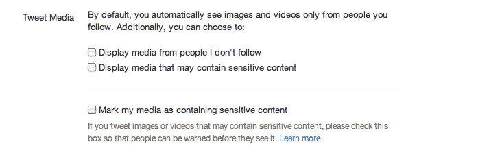

# Twitter 为含有 NSFW 内容的推文添加“可能敏感”标识 TechCrunch

> 原文：<https://web.archive.org/web/https://techcrunch.com/2011/07/28/twitter-adds-possibly-sensitive-designation-to-tweets-with-nsfw-content/>

# Twitter 为含有 NSFW 内容的推文添加了“可能敏感”的标识

Twitter[刚刚向开发者宣布](https://web.archive.org/web/20221005192831/https://dev.twitter.com/discussions/700),它已经在其流媒体 API 中添加了一个“可能敏感”内容的字段，在一次测试中，最终将为 Twitter 带来更细粒度的最终用户媒体设置。

Twitter 开发者泰勒·辛格特里写道，

> 从今天开始，你可能会注意到 API 响应和包含 tweets 的流中有一个新的布尔字段:“possibly_sensitive”。这个新字段只有在 tweet 包含链接时才会出现。该字段的含义与推文内容本身无关，而是表明推文中包含的 URL 可能包含被识别为敏感内容的内容或媒体。
> 
> 在这个初始测试阶段，您不需要对这个字段做任何事情，字段值的准确性也不可靠。将来，我们将有一系列额外的 API 方法和字段来处理最终用户的“媒体设置”和可能的敏感内容。"

Twitter 代表 Carolyn Penner 告诉我，API 的这一变化意味着，最终当用户[将自己或其他用户的内容标记为可能敏感时，会在推文的媒体详细信息窗格中显示警告，在其他用户点击之前通知他们标记的内容。Penner 说，虽然自从 Twitter 推出 Photos 以来，将内容标记为敏感的功能就已经存在，但细节窗格上的“敏感内容”标记是新的。](https://web.archive.org/web/20221005192831/https://support.twitter.com/articles/20069937)

彭纳告诉我，敏感内容字段将涉及推文中的所有照片和视频链接，包括来自 Instagram、Twitpic 和 Pic.Twitter.com 的照片和视频链接。“我们希望确保用户有一个良好的照片体验，同时让他们能够控制他们将要看到的东西，”Penner 在决定增加新的名称时说。

