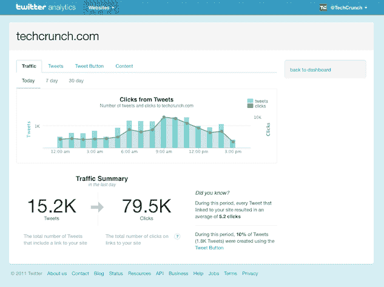

# Twitter 打开网络分析的和服；现在有 300 万个网站在使用 Tweet 按钮 

> 原文：<https://web.archive.org/web/http://techcrunch.com/2011/09/13/twitter-analytics/>

众所周知，Twitter 为出版商提供的服务中缺少的一部分是深度分析平台。去年，该网络[开始为](https://web.archive.org/web/20230205000008/https://techcrunch.com/2010/08/12/twitter-tweet-button/)提供一个发布者可以嵌入网站的推文按钮，甚至最近[开始以其](https://web.archive.org/web/20230205000008/https://techcrunch.com/2011/06/07/twitter-now-automatically-shortens-links/)[t.co 格式包装](https://web.archive.org/web/20230205000008/http://blog.twitter.com/2010/06/links-and-twitter-length-shouldnt.html)链接，帮助该公司“了解用户如何参与 Twitter 上每天分享的数千万个链接。”但是，尽管给了出版商这些分享产品，Twitter 还没有提供一个分析平台，让出版商了解有多少推文和链接通过 Twitter 发送和分享。事实上，广告商是 Twitter 为其创建定制分析的唯一合作伙伴。直到现在。

今天，在 TechCrunch Disrupt 上，Twitter 推出了一个全新的发布者分析平台，帮助网站理解关于 Tweet 按钮的数据和使用 t.co 包装的网站。虽然该平台仍然是私有的，但 Twitter 表示，它将很快向公众推出。

Twitter 帮助网站带来流量，这已经不是什么秘密了。随着 1 亿活跃用户每天发送 2.3 亿条推文，该公司正在推动大量的网络分享活动。Twitter 的网络业务开发总监 April Underwood 告诉我们，Tweet 按钮可以很容易地嵌入任何网站，现在有超过 300 万个网站在使用它。

Twitter 每天为网站带来 1 亿次点击，Twitter 上 95%的链接都在 T.co。因此，很明显，随着入站和出站流量的增加，Twitter 网站获得了巨大的吸引力。

尽管许多第三方应用程序试图为出版商衡量 Twitter 的流量，但最好的分析总是来自源头。这款面向出版商的新产品将通过 Tweet 按钮和链接解读出版商网站的所有入站和出站流量。

以下是新分析平台的工作方式。当你登录到你的指定账户时，你会看到一些指标，包括有多少条推文(这包括所有类型的推文)，网络上包括你的发布者网站的链接，以及点击量。你还可以通过一个 Tweet 按钮，查看从该网站发送的任何 Tweet 的每周、每天和每月点击量。安德伍德告诉我们，这是干净的数据，已经从推文中过滤了任何机器人或垃圾邮件。

Twitter 还将向您显示从您网站上的 Tweet 按钮发送的所有 Tweet，以及任何带有到您网站的入站链接的 Tweet。在分析平台上，你可以转发这些推文，也可以回复这些用户。

另一个非常有用的功能是能够通过推文和点击查看日、周和月的热门链接。用户还可以向仪表板添加多个网站和子域。此外，Twitter 将向用户显示给定时间段内收到的平均点击数，以及使用 Tweet 按钮生成的 Tweet 的百分比。

当然，许多人使用谷歌分析和其他平台对 Twitter、脸书和其他人的社交媒体进行分析。幸运的是，你将能够从你选择的平台中整合这些深入的 Twitter 分析，因为 Twitter 将为这个分析平台发布一个 API。

最棒的是——所有这些对出版商都是免费的。一些精选的出版商目前也在测试这个平台。

这个平台实际上诞生于社交分析初创公司 BackType，Twitter [几个月前收购了它。自收购以来，这些新工程师一直在不知疲倦地推动这一产品，它几乎已经完成。BackType 的原始产品功能更加丰富，帮助出版商了解他们的推文和内容的覆盖范围，他们接触到的人，以及推文如何转化为网络流量。当然，今天宣布的这个平台是一个更简单的版本，但它是一个安全的假设，Twitter 将在未来为其分析平台添加更多的功能。](https://web.archive.org/web/20230205000008/https://techcrunch.com/2011/07/05/twitter-acquires-social-analytics-startup-backtype/)