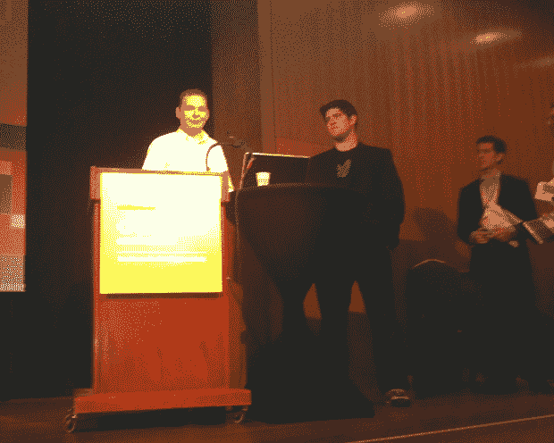

# Twitter 和 Mediasift 合作转售消防软管数据| TechCrunch

> 原文：<https://web.archive.org/web/http://techcrunch.com/2011/04/04/twitter-and-mediasift-announce-partnership/>

# Twitter 和 Mediasift 合作转售消防软管数据

 Twitter 和实时数据监管服务 [Mediasift](https://web.archive.org/web/20230406163841/http://www.datasift.com/) 刚刚在 Mission Bay 会议中心举行的 [Data 2.0 会议](https://web.archive.org/web/20230406163841/http://data2con.com/)上宣布了数据转售合作关系。

这一举措类似于五个月前 Twitter 与实时数据提供商 [Gnip](https://web.archive.org/web/20230406163841/http://gnip.com/twitter) 合作，将 Twitter 的部分 firehose [投入商业使用](https://web.archive.org/web/20230406163841/http://www.readwriteweb.com/archives/twitter_to_sell_50_of_all_tweets_for_360kyear_thro.php)，除了 Gnip 专注于批量搜索而不是垂直搜索。

根据 Sarver 的说法，Mediasift 将*“服务于我们无法服务自己的分析市场。”“我们正试图将数据处理商品化，”*创始人 Nick Halstead 谈到为开发者提供使用 Mediasift 的 DataSift 来分析 Twitter firehose 的能力。

霍尔斯特德的公司过去专注于 Tweetmeme，但在 9 月份的 TechCrunch Disrupt i [上，该平台扩展到了所有实时数据。](https://web.archive.org/web/20230406163841/https://techcrunch.com/2010/09/27/tweetmeme-founders-datasift-helps-you-find-a-needle-in-a-tweetstack/) DataSift 的平台通过拖放式图形界面为开发人员提供警报、分析和实时 API。

DataSift 的面包和黄油能够深入挖掘垂直数据，例如在 Twitter 上以积极的情绪提到星巴克，或者具有特定 Klout 分数的人在 Foursquare 上签到。

萨弗[告诉开发者](https://web.archive.org/web/20230406163841/http://groups.google.com/group/twitter-development-talk/browse_thread/thread/c82cd59c7a87216a)在三月份停止专注于构建 Twitter 客户端，专注于数据和不同的利基垂直市场。看来 Datasift 已经照办了。

