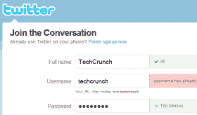

# 你不应该(也不能)在 Twitter 上使用的 370 个密码 

> 原文：<https://web.archive.org/web/https://techcrunch.com/2009/12/27/twitter-banned-passwords/>

# 你不应该(也不能)在 Twitter 上使用的 370 个密码

如果你在 [Twitter](https://web.archive.org/web/20221007231909/http://twitter.com/) 上，这意味着你注册了一个密码不易被猜到的账户。你可能知道，Twitter 通过指出某些密码，如“密码”([咳咳](https://web.archive.org/web/20221007231909/http://www.beta.techcrunch.com/2009/07/15/another-security-tip-for-twitter-dont-use-password-as-your-password/))和“123456”，来阻止人们这么做。

恰好 Twitter 在[注册页面](https://web.archive.org/web/20221007231909/https://twitter.com/signup)上硬编码了所有被禁密码。要检索不受欢迎的密码的完整列表，您只需查看该页面的源代码。

做一个简单的搜索' twttr。“禁用 _ 密码”，瞧，总共 370 个。

当然，这不是一个安全问题，事实上，分发这个列表是有帮助的，这样您就可以检查您用于其他服务的最喜欢的密码是否没有您想的那么可靠。要获得完整的列表，只需下载这个 TXT 文件，这里有几个:

–密码
–测试
–裸体
–愚蠢
–推特
–123456
–秘密
–拜托
–比维斯
–平头
–互联网
–汽笛

有趣的是，Twitter 是否从其他地方获得了这份名单，或者他们是否真的分析了过去数千万用户最常选择的密码，从而使它们“太明显”。如果是后者，这意味着这个列表可能代表了大多数 Web 服务。

(感谢达里奥·马努基安的提示；快速搜索会在[神童计数器](https://web.archive.org/web/20221007231909/http://blog.wundercounter.com/2009/12/twitter-and-avoiding-weak-passwords.html)上找到一个帖子，也是该榜单的特色)