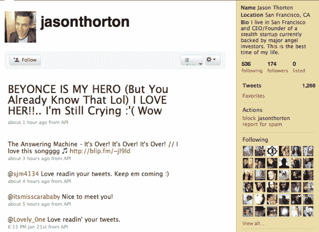
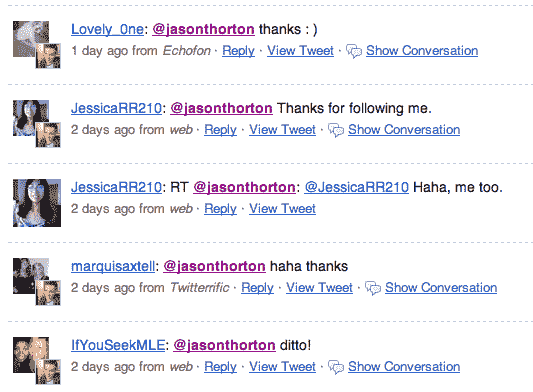

# 你的推特机器人需要的只是爱

> 原文：<https://web.archive.org/web/http://techcrunch.com/2010/01/22/twitter-bot-love/>

# 你的推特机器人需要的只是爱

任何在 Twitter 上呆了几天以上的人都知道，它充斥着机器人——由计算机而不是人类运行的账户。虽然机器人可能很容易获得，但你并不经常有机会通读代码。今晚，你有机会了。机器人的名字？杰森·索顿。几个月来，他一直在哼唱，向大约 174 名粉丝发送了超过 1250 条推文。他的推文虽然不是特别有创意，但却做到了既可信又及时。他的动力来自一个词:爱。

索顿是开发者瑞安·梅尔克特的创造，他在大约三个小时内把它作为一个辅助项目建造出来。Merket 刚刚[发布了](https://web.archive.org/web/20230311084525/http://ryanmerket.com/blog/2010/01/22/building-a-twitter-bot/)赋予他力量的代码，还透露了他是如何让 Thorton 看起来有点现实的:机器人会寻找含有“爱”这个词的推文，并将其作为自己的推文。来自 [Merket 的博客](https://web.archive.org/web/20230311084525/http://ryanmerket.com/blog/2010/01/22/building-a-twitter-bot/):

> Jason 发了很多关于“爱”这个词的推文——那是因为 Jason 实际上从公共时间轴上窃取了包含“爱”这个词的推文，并作为自己的发布。
> 
> 杰森还@回复那些在推文中使用“爱”这个词的人，问他们一些随意的问题或者说一些武断的话。

然后，Merket 继续详细说明了为什么他构建这个机器人的容易程度应该引起人们的关注:

> 我花了大约 3 个小时编写 Jason 代码，想象一下一个真正的工程师可以用真正的 AI 算法做什么？现在意识到这已经是现实了。像 Twitter 这样的网站充满了附带项目、公司计划、垃圾邮件机器人和人工智能机器人。当信息的自由流动变得开放时，虚假信息的数量就会增加。真的需要有人来审查我们在社交网站上“遇到”的人——看看这个市场在明年如何增长会很有趣。

社交网络真的能审查每一个加入的用户吗？这可能难以置信地难以扩展，但算法肯定有改进的空间。无论如何，以下是杰森最近的一些推文:

下面是一些中了他们的人:
