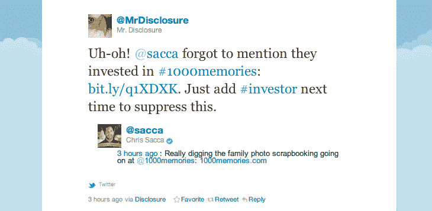

# Twitter Bot @MrDisclosure 希望投资者在推文中披露冲突 TechCrunch

> 原文：<https://web.archive.org/web/https://techcrunch.com/2011/09/27/twitter-bot-mrdisclosure-encourages-investors-to-disclose-conflicts-in-tweets/>

# Twitter Bot @MrDisclosure 希望投资者在推文中披露冲突

对一个科技投资者来说，外面的世界很艰难！你现在正与浮华的好莱坞人士竞争，比如阿什顿·库彻，他们拥有无与伦比的机会，比如在他们的最新角色 T2 的笔记本电脑上炫耀他们的投资关系，你知道他们在美国最受欢迎的情景喜剧中扮演的科技创业公司创始人角色。

正是库彻先生自己的滑稽动作启发了 [@MrDisclosure](https://web.archive.org/web/20230204213732/http://www.twitter.com/mrdisclosure) ，一个 Twitter 机器人[试图让投资者](https://web.archive.org/web/20230204213732/http://mrdisclosure.tumblr.com/)披露他们已经投资了他们一直在 Twitter 上谈论的那家公司。在库彻编辑的一期《细节》杂志[遭到批评](https://web.archive.org/web/20230204213732/http://gawker.com/5831935)后，库彻未能披露他在其中一些公司的股份，@MrDisclosure 创始人 Andy Cheung 建立了这个账户，希望引起人们对投资者冲突问题的关注。

“我确实相信，如果你在推特上发布关于你的投资组合公司之一的消息，你有责任披露你与该组织的关系，”Cheung 在解释该账户的帖子中写道。目前，它追踪的(有限数量的)人可以通过使用#投资者标签避免被包括在可能令人不快的推文中。

但是那个笨拙的#投资者标签真的是最好的解决方案吗？这让那些试图按照自己的(albiet 临时)规则行事的少数人怎么办，比如[乔希·科佩尔曼](https://web.archive.org/web/20230204213732/http://www.crunchbase.com/person/josh-kopelman)，他[在每条关于一家公司的推文中加上](https://web.archive.org/web/20230204213732/https://twitter.com/#!/joshk/status/118797580552503296)[首轮资本](https://web.archive.org/web/20230204213732/http://www.firstround.com/)投资的#FRC，或者[克里斯·萨卡](https://web.archive.org/web/20230204213732/http://www.crunchbase.com/person/chris-sacca)，他在自己的推特简历中明确表示自己是一些公司的投资者。

如果我们正在走向一个所有事情都需要公开的未来，我们将需要远远超过 140 个字符。

*谢谢！[@ MBaratz](https://web.archive.org/web/20230204213732/http://www.twitter.com/mbaratz)/图片 via: [@Dens](https://web.archive.org/web/20230204213732/http://instagr.am/p/OUOBS/)*