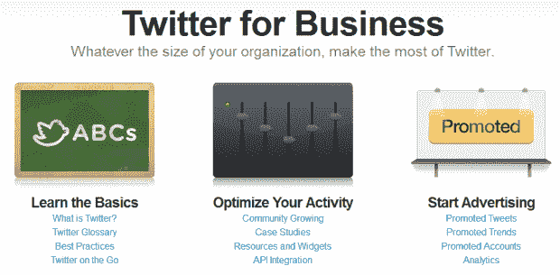
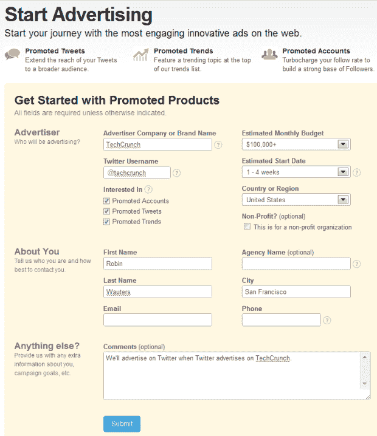

# Twitter 征集对“网络上最吸引人的创新广告”的兴趣

> 原文：<https://web.archive.org/web/https://techcrunch.com/2010/12/15/twitter-business/>

# Twitter 征集对“网络上最吸引人的创新广告”的兴趣

正如[早先提到的，Next Web](https://web.archive.org/web/20221005174152/http://thenextweb.com/twitter/2010/12/15/twitter-launches-revamped-guide-for-businesses/) 和 [ReadWriteWeb](https://web.archive.org/web/20221005174152/http://www.readwriteweb.com/archives/twitter_launches_online_form_to_buy_ads_trending_t.php) ， [Twitter](https://web.archive.org/web/20221005174152/http://www.crunchbase.com/company/twitter) 刚刚发布了最新的[商业指南](https://web.archive.org/web/20221005174152/http://business.twitter.com/)，供有兴趣探索如何充分利用微共享服务的组织使用。

巧合的是， [@TwitterBusiness](https://web.archive.org/web/20221005174152/http://twitter.com/#!/TwitterBusiness) 账户还没有让关注者意识到这些变化——事实上，自从该账户发布推文以来，已经过去了大约一周。

**更新:**来自 Twitter 博客:[现在是营业时间](https://web.archive.org/web/20221005174152/http://blog.twitter.com/2010/12/its-business-time.html)(而 [@TwitterBusiness](https://web.archive.org/web/20221005174152/http://twitter.com/#!/TwitterBusiness) 又醒了！)

扩展后的商业指南包括一个帮助公司开始在 Twitter 上做广告的部分，邀请广告商踏上“最吸引人的网络创新广告之旅”。

我不太相信整个事情的创新性，但 Twitter 在解释他们如何计划通过广告赚钱方面做得很好([推广推文](https://web.archive.org/web/20221005174152/http://business.twitter.com/advertise/promoted-tweets)、[推广趋势](https://web.archive.org/web/20221005174152/http://business.twitter.com/advertise/promoted-trends)和[推广账户](https://web.archive.org/web/20221005174152/http://business.twitter.com/advertise/promoted-accounts))。

有趣的是，Twitter 还宣传了一款名为 [Analytics](https://web.archive.org/web/20221005174152/http://business.twitter.com/advertise/analytics) 的貌似新的产品，它通过提供两层分析(广告产品仪表盘和时间线活动)，让所有广告商都能洞察 Twitter 上的付费和免费活动。

Start 广告页面还带有一个不容错过的[表格](https://web.archive.org/web/20221005174152/http://business.twitter.com/advertise/start)，邀请组织表明他们对哪些广告产品感兴趣，他们心目中的预算和发布日期，他们在哪些地区运营，以及他们是否是盈利性的。

这绝不是自助服务，就像谷歌 AdWords 一样，但这是一个开始。

随着这种形式的试运行，Twitter 实际上是在说它现在已经开始营业了，并且(希望对他们来说)已经有了一个销售团队来处理所有的请求。

2011 年，Twitter 不仅会想出如何合理地赚钱，还会设法扩大赚钱业务的规模，让公司实现可持续盈利吗？

