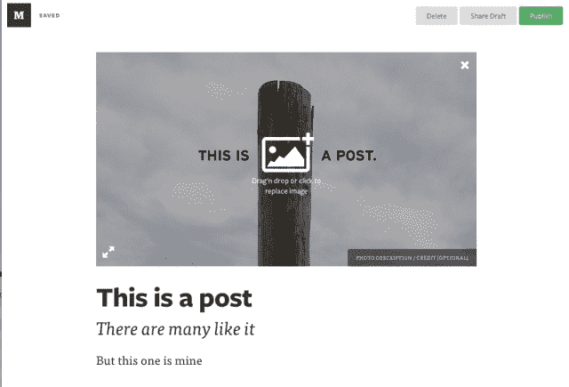

# Twitter 联合创始人伊万·威廉姆斯的博客平台 Medium 向所有人开放注册

> 原文：<https://web.archive.org/web/https://techcrunch.com/2013/10/25/twitter-co-founder-evan-williams-blogging-platform-medium-opens-signups-to-all/>

# Twitter 联合创始人伊万·威廉姆斯的博客平台 Medium 向所有人开放注册

Twitter 的联合创始人伊万·威廉姆斯有一个名为 Medium 的新博客平台，自推出以来一直没有人注册。今天，该平台发出了一封电子邮件，消息是[任何人现在都可以登录并开始编写](https://web.archive.org/web/20230307100633/https://medium.com/about/5ab1de76e764)。

注册和使用 Medium 有一些要求。你必须在 Chrome、Safari 或 Firefox 浏览器上写文章，并且你必须有一个 Twitter 账户来发布文章。有一个通过电子邮件发送的验证链接，你点击它就可以进入了。移动设备仍不支持发帖。

威廉姆斯在将自己的公司 Pyra Labs 出售给谷歌后，与诺亚·格拉斯(Noah Glass)一起创立了 Odeo——Twitter 的母公司。Pyra 的主要产品是 Blogger，这是我们现在所知的“博客”的早期产品之一。现在，威廉姆斯又开始了博客游戏。

【T2

上个月，Williams [向 TC 讲述了他对媒体的愿景](https://web.archive.org/web/20230307100633/https://techcrunch.com/2013/09/14/twitter-co-founder-evan-williams-lays-out-his-vision-for-medium/):

> “我认为如果更多的人分享他们的想法，更多的人会生活得更好，”威廉姆斯说。从这个角度来看，Medium 只是威廉姆斯三个产品周期的下一个逻辑步骤，为世界注入更好的想法。博客帮助睡衣博客们打开了与媒体巨头竞争的大门。几年后，Twitter 将广播分发的权力交给了每个有 140 个字符要分享的人。
> 
> 现在，为了完成这一循环，Medium 希望让病毒式信息变得更具实质性——这是传播的潘多拉盒子中的希望。“这也是一种乐观的立场，我们可以建立一个系统，让好的东西能够发光并得到关注。除了满足人类最基本的欲望之外，还有一些想法和故事吸引着观众。”

我接触媒体已经有一段时间了，但还没怎么用过。但我确实喜欢整体的写作体验，简洁而快速。围绕一张图片写一篇文章，或者压缩一些文字，点击发布，感觉很容易。它肯定比 WordPress 等其他选择要轻得多，并且与 Dustin Curtis 的 Svbtle network 提供的发布工具有很多共同点。

Medium 在众多博客选择中获得了相对的知名度，但并不总是出于最好的原因。虽然有一些有趣的内容，但也有一些失误，如虚假声称[政府电子邮件窥探](https://web.archive.org/web/20230307100633/https://techcrunch.com/2013/08/01/employer-tipped-off-police-in-pressure-cookerbackpack-gate-not-google/)和彼得·施的《[我讨厌三藩市的 10 件事》帖子](https://web.archive.org/web/20230307100633/http://valleywag.gawker.com/startup-stud-hates-homeless-people-ugly-girls-and-pub-1150802451)。诸如此类的话题给了媒体一个缺乏自我意识和不准确的孵化器的名声。不过，威廉姆斯在与 TC 的聊天中相当坦率地提到了这些问题。

威廉姆斯告诉我们:“请不要设置这个，因为埃文认为科技博客是垃圾，因此正在用 Medium 修复它们。”“人们会在媒体上发表垃圾。”

如果你有兴趣，你可以[在这里](https://web.archive.org/web/20230307100633/https://medium.com/about/5ab1de76e764)报名。