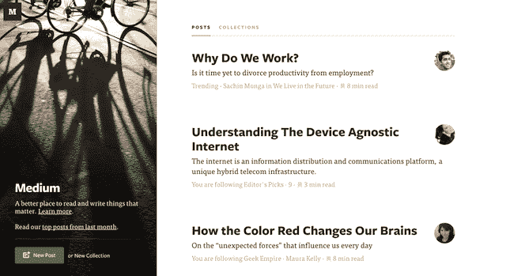
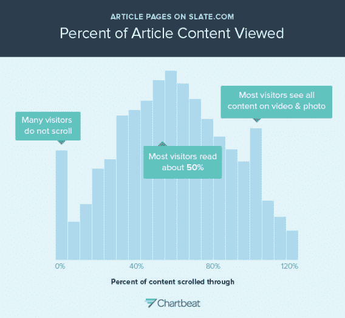
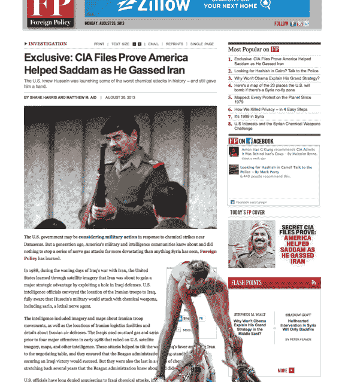

# Twitter 联合创始人伊万·威廉姆斯展示了他对媒体未来的计划

> 原文：<https://web.archive.org/web/https://techcrunch.com/2013/09/14/twitter-co-founder-evan-williams-lays-out-his-vision-for-medium/>

Twitter 的联合创始人伊万·威廉姆斯有一个雄心勃勃的新计划:改变我们的日常阅读习惯，从消费增量新闻片段转向参与由智能算法策划的开明想法。通常，如果不是因为威廉姆斯是多次扰乱媒体行业的少数互联网先驱之一，这样的目标似乎是乌托邦式的。

在 Twitter 改变新闻传播的格局之前，威廉姆斯的第一部红极一时的作品 Blogger 成为了业余作家新贵挑战老牌作家的同名品牌

最重要的是，他的新平台 Medium 发布了大部分长篇内容，迅速赢得了人气——也声名狼藉。仅在几个月内，其最受欢迎的贡献就登上了头版头条，并获得了数百万的浏览量。在我们的硅谷泡沫中，它的贡献者半定期地在互联网精英中引发全行业的对话。

“Twitter 联合创始人的网站已经成立一年了，仍然很神秘，”[最近写道](https://web.archive.org/web/20230307232139/http://www.theatlantic.com/technology/archive/2013/08/what-is-medium/278965/) *《大西洋月刊》*的 Alexis Madrigal，这是试图理解互联网千万富翁的神秘新项目的许多故事之一。

现在，自从威廉姆斯去年在我们自己的 TechCrunch Disrupt 会议上推出了 Medium 的测试版以来，威廉姆斯第一次准备好说话了。

## **新闻“废话”Vs 一本书**

威廉姆斯直接瞄准了新闻业最令人尴尬的弱点:不断需要夸大平凡的事情，以使读者习惯于需要新闻，就像每天需要药物一样。

“一般来说，新闻在大多数时候并不重要，如果大多数人花时间少看新闻，多思考有更持久意义的想法，他们会过得更好，”他在一个临时的市场街道办公室里接受我们的采访时告诉我，那里的住房面积中等，直到顶部两层楼为他不断增长的团队做好准备。“就算是虚构的，大部分时候大概也比较好。”

是真的。每日新闻周期并不总是做好启发美国民主的工作。在题为“媒体重要吗”的研究论文中，一组经济学家[发现](https://web.archive.org/web/20230307232139/http://www.aeaweb.org/articles.php?doi=10.1257/app.1.2.35)让一组随机的公民阅读*华盛顿邮报*对“政治知识、公开的观点或选举后调查和选民数据中的投票率”没有任何帮助。

新闻本身显然不足以让我们成为一个更有见识的社会。

相反，威廉姆斯认为，公民应该重新调整他们对信息的贪婪胃口，转向更令人敬畏的内容。“出版的书面想法和故事是改变生活的，”他滔滔不绝地说，回忆起他童年时对书籍的迷恋，这是他挑战媒体机构的动力。互联网“释放了那种对书本中知识的兴奋感——为这个世界倍增、释放和解锁；而且，世界在各个方面都会变得更好。”

在威廉姆斯的宏大视野中，大众阅读是为了启蒙；新闻退居次要地位，与它让我们获得更多信息和灵感的频率成正比。

除了更好的内容，新闻本身由行业专业人士撰写可能更好。他认为，来自保守派渠道的气候否认者是媒体未能履行告知公众义务的主要例子。在我们的谈话中，在一个关于全球变暖的长篇大论中，他没有完整地解释为什么作为作家的行业专业人士会解决这个问题。但是，很容易想象，如果几乎所有的气候科学家都相信人为造成的全球变暖，媒体将很难找到一个可信的作家来证明这一点。

房间里的大象是，Williams 并没有那么微妙地攻击我和我的同事，特别是考虑到他曾[声称](https://web.archive.org/web/20230307232139/http://www.businessweek.com/articles/2013-08-22/twitter-co-creator-ev-williams-stretches-the-medium)“科技博客的现状很糟糕——完全是废话。”我请他解释他的意思，尽量不要听起来被冒犯了。

他委婉地澄清了自己的话，回应道:“很多科技博客之所以糟糕，部分原因是写博客的人并不真正明白他们写的是什么。所以我想改变我们对专业写作的定义。至少扩大一下。”

威廉姆斯对记者和业内人士之间的长期争论明确表态，他表示，TechCrunch 由知名商人撰写的周末专栏“绝对比一些缺乏商业经验的记者撰写的日常新闻更有价值”。

然而，威廉姆斯很清楚:“请不要设置这个，因为埃文认为技术博客是垃圾，因此正在用 Medium 修复它们。人们会在媒体上发表废话。”

威廉姆斯指的是一些臭名昭著的媒体帖子，这些帖子厚颜无耻地宣扬精英主义，散布错误信息。硅谷企业家彼得·施(Peter Shih)的《我讨厌你的 10 件事:旧金山版》(10 Things I Hate on You:San Francisco Edition)受到了广泛批评，因为它延续了硅谷对无家可归者的可鄙的厌女症和麻木不仁。在另一个尴尬的时刻，媒体撰稿人 Michele Catalano [错误地暗示](https://web.archive.org/web/20230307232139/https://techcrunch.com/2013/08/01/employer-tipped-off-police-in-pressure-cookerbackpack-gate-not-google/)在她在谷歌搜索“背包”和“高压锅”后，邪恶的政府间谍没收了她的电脑。这两个帖子后来都被修改或撤下。尽管这些失误[在媒体和少数媒体上引发了一系列深思熟虑的反击，威廉姆斯并没有试图将这些反应扭曲成胜利。](https://web.archive.org/web/20230307232139/http://www.huffingtonpost.com/2013/08/16/peter-shih_n_3768505.html)

“人们会在媒体上发表废话…你猜怎么着？推特上有垃圾。博客上有垃圾。网上有垃圾。如果我们试图让垃圾远离互联网，互联网就不会变得重要，”他争辩道，他的声音中带有明显的防御性，掩饰了他向后仰的姿态。“如果有很棒的东西没有被公开，或者得到了更多的关注，那么这个系统就是有效的。”

好吧，那么威廉姆斯的解决方案是什么呢？

## **吸引每个好主意的简单媒介**

“每个人都有值得重复的故事或见解，只是他们没有地方让别人听到，”前 Wired.com 编辑埃文·汉森补充道，他是 Medium 的高级编辑，负责扩大其技术，科学和商业报道。Medium 认为自己是专业媒体的混合体，比如纽约时报和赫芬顿邮报(隶属于 TechCrunch 母公司 Aol)的免费博客。相反，Medium 希望成为每个人真正流行的想法的平台。

健康创业企业家尼克·克罗克可能从来没有想到他的关于在当地杂货店的垃圾食品通道散步的简单帖子会获得超过 100 万英镑的收入。)观点。克罗克精心制作的《世界真他妈的疯狂》是一部以照片为中心的第一人称之旅，在他去买牛奶的路上，穿过堆满化学改变的含糖食品的杂货店过道。它直观简单，显然表达了公众对美国健康危机的潜在不满，这是其他充满统计数据的医学新闻所没有的。

另一个例子是，Aron Solomon [让智能手机打车应用优步](https://web.archive.org/web/20230307232139/https://medium.com/this-happened-to-me/15857aaa06f2)成为全国关注的焦点，因为它在多伦多大规模夏季风暴期间无意中制定了飙升的价格。一些新闻媒体报道了这一令人尴尬的事件，但没有什么像一个无辜的旁观者的声音一样传播开来，他对自己令人毛骨悚然的帖子“不要做混蛋规则”中的疏忽价格欺诈感到愤怒

最重要的是，这两个帖子都是在最激烈的时刻写的。在 Medium，没有必要注册一个网站，筛选堆积如山的设计选项，并为博客的习惯重新组织你的时间表。你只管写。“如果是突发奇想，当你被迫找到一个独特的子域并找到一个模板时，这个突发奇想就被扼杀了，”Williams 解释道。

Medium 写作平台的简单性赢得了备受尊敬的作家和设计师的赞誉。Medium 是“网络上最棒的构图体验，毫无疑问”[写道](https://web.archive.org/web/20230307232139/https://medium.com/the-year-of-the-looking-glass/8a824a0d2ef5)早期脸书设计师 Julie Zhuo 在一篇关于 Medium 的帖子中写道。“你可以清楚地看到你的帖子会变成什么样子。不需要翻译，不需要猜测，不需要在一些冗长的文本区域打字，也不需要担心它是否能正确处理*和*的和:)"

《纽约时报》科技专栏作家尼克·比尔顿也给了媒体一个重击。“我真的很喜欢 Medium——这是技术真正成为背景的罕见例子之一，”他在一封电子邮件中给我写道。"我希望能够在我的个人网站上用 Medium 代替 WordPress . "对 WordPress 来说幸运的是，Medium 没有计划成为一个独立的博客平台——但是，它可能会成为那些不想为建立一个博客而烦恼的偶尔出现的行业缪斯的家。

尽管如此，Medium 并不认为昙花一现的帖子是一个可持续的基础。它已经拨出了相当大的预算来支付专业杂志式的曝光。最近，它资助了一个 10，000 字的大型电影剧本，讲述了一名 62 岁的突击队员的诱人生活，包括在秘鲁矿山找回价值 300 万美元的金条的任务。“[雇佣军](https://web.archive.org/web/20230307232139/https://medium.com/editors-picks/ac3bd0d025f5)”是由同一位广受好评的作者编辑的，他在 2007 年发表的关于释放伊朗人质的文章最终成为奥斯卡获奖的小说改编版 *Argo* 。在接下来的 18 个月里，合作工作室 Epic 承诺再推出五部《边缘故事》。

战地记者大卫·阿克斯也带来了一些沉重的长篇解说，讲述令人毛骨悚然的军事技术。尽管 Medium 暗示不愿意反对专业作家，但它显然愿意投资公共互联网新闻。

“我总是觉得，作为媒体中的一个严肃品牌，你不能没有昂贵的独家新闻，”汉森解释说。“如果你一直追求低端，那么广告商就不想和你有任何关系。有钱的人和富裕的读者，以及在你的权威和影响力覆盖的领域中有职位的人不读你的书。你变得有点像，你什么都不是。”

汉森坚持认为，媒体仍在试验中。无论最终走向何方，Medium 显然都希望成为任何大胆的、病毒式的想法的大本营——它愿意用金融和工程推土机来跨越写作的任何障碍。

然而，即使作家愿意进入媒体，读者如何在一个仍然默默无闻的出版商那里找到他们呢？

## **实质性阅读的潘多拉，浏览量见鬼去吧**

传统的新闻编辑将他们的声誉建立在直觉上，直觉告诉他们是什么吸引了他们网站的眼球。然而，编辑不知道读者是否会得到更多的信息。

威廉姆斯认为 Medium 有一个答案:一种智能算法，它主要根据用户阅读某些文章的时间来建议故事(这是他第一次公开讨论)。就像潘多拉为音乐发现所做的一样，Medium 的新智能馆长旨在改善人工滚动互联网并询问他人阅读内容的人工系统。

在算法本身中，Medium 优先考虑花在一篇文章上的时间，而不是简单的页面浏览量。“花费的时间本身实际上并不是一个价值，但在一个人们有无限选择的世界里，如果人们获得了价值，这是一个很好的衡量标准，”Williams 解释道。

为新闻编辑说句公道话，我们确实知道读者在一篇文章上花了多少时间:我们知道不到 60%的人会读一篇文章的一半以上，而相当一部分人根本不会读任何东西。“我会保持这种简短，因为你不会逗留太久。科技专栏作家法尔哈德·曼朱在 Slate 上发表了一篇宣泄性的文章，标题恰如其分:“你不会读完这篇文章:为什么网上的人不读到底。”他开玩笑说:“我已经失去了你们中的一部分人。”

但是，因为广告商为页面浏览量付费，所以无论我们如何努力展示其他种类的高质量内容，他们的动机都是为了获取点击量。

例如，在麦莉·赛勒斯在 MTV 音乐录影带大奖易受影响的青少年观众面前表演了臭名昭著的滑稽舞之后，*《洋葱》*精彩地抨击了 CNN 将滑稽剧作为头版新闻的决定。

所以，你可能会问，为什么今天早上的头条新闻，通常是当天最重要的国内外新闻，标题是“麦莉·赛勒斯做了什么？？？并附有副标题“Twerks，在 VMAs 上令人震惊”？《洋葱报》在 CNN 总编辑的一篇讽刺文章中写道。

“答案很简单。这是一种让你点击 CNN.com 的尝试，这样我们就可以提高我们的网络流量，从而增加我们的广告收入。没有任何东西，我的意思是没有任何东西，与当天的重要新闻、重大人类事件的记录或新闻本身可以成为世界积极变革的力量的想法有关。”

(网络反应的另一个亮点是麦莉·赛勒斯关于重要事情的 Tumblr。)

我想我们新闻行业的大多数人都会喜欢我们的观众只关心深刻的实质性故事，但[页面浏览量相对较少的昂贵内容无法支付账单](https://web.archive.org/web/20230307232139/http://blogs.reuters.com/felix-salmon/2012/02/12/quality-vs-quantity-online/)。那么，Medium 不打广告赚钱的计划是什么？

## **“网民”与金融稳定**

简而言之，没有人真正知道。“嗯，在某种程度上，它必须是可持续的。因此，我认为收入是模型中的一部分，”汉森说，他漫不经心的态度表明分众传媒目前对货币化问题的关注是多么的少。

一种选择是出售电影剧本以外的电子书。例如，一部分读者可能愿意为 Kindle 版的《雇佣兵》的便利付费。但是，这种风险投资要想赚钱，流量必须非常大。佣兵的浏览量还可以。“它没有把盖子吹掉，”汉森承认，他指的是其他获得几百万浏览量的媒体作品。

其他盈利选择包括许可其技术，以及与希望在 Medium 上发布故事的老牌媒体品牌分享收入(Mother Jones 已经在 Medium 上发布了一些故事，而 Gawker 已经在自己的网站上批发了受欢迎的 Medium 帖子)。

尽管 Medium 还没有一个可靠的商业计划，但有一个方法可以让它疯狂地考虑产品第一，金钱第二(或第三)。威廉姆斯有一种有趣的方法，可以将硅谷的企业类型分为两类，一类是在网络泡沫破灭时成功管理公司的人(“网络人”)，另一类是收拾好自己的空袋子离开的人(“网络人”)。

他解释说，网民“热爱网络。我们热爱可能发生的事情，我们热爱创造力，我们投身其中去创造；我们不是为了赚钱。”

因此，当泡沫破裂时，网络人留了下来——有些人最终制造出了我们今天都在使用的(非常)有利可图的产品。“网民更具可持续性，因为他们坚持不懈。因为他们被驱使去创造，他们被网络吸引是因为它的创造潜力。当这看起来不是一条快速致富的道路时，他们并没有被吓跑。”他解释说，“他们坚持不懈。”

## **让威廉姆斯坚持不懈的乐观赌注**

“我认为如果更多的人分享他们的想法，更多的人会生活得更好，”威廉姆斯说。从这个角度来看，Medium 只是威廉姆斯三个产品周期的下一个逻辑步骤，为世界注入更好的想法。博客帮助睡衣博客们打开了与媒体巨头竞争的大门。几年后，Twitter 将广播分发的权力交给了每个有 140 个字符要分享的人。

现在，为了完成这一循环，Medium 希望让病毒式信息变得更具实质性——这是传播的潘多拉盒子中的希望。“这也是一种乐观的立场，我们可以建立一个系统，让好的东西能够发光并得到关注。除了满足人类最基本的欲望之外，还有一些想法和故事吸引着观众。”

或者，从本质上说，Medium 最大的赌注是，“人们会读长的东西——他们会读很多。”这里面有一门生意。