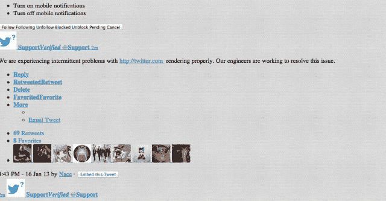

# Twitter.com 正在经历“渲染”问题，所以如果你喜欢丑陋的网站，现在就访问它(更新)

> 原文：<https://web.archive.org/web/https://techcrunch.com/2013/01/16/twitter-com-experiencing-rendering-issues-so-if-you-like-ugly-websites-visit-it-now/>

# Twitter.com 正在经历“渲染”问题，所以如果你喜欢丑陋的网站，现在就访问它(更新)

虽然不是前几年流行的“失败鲸”，Twitter.com 确实是有一些问题的。根据其支持帐户的推文，工程师正在解决“渲染”问题。很多 Twitter 用户依赖移动和桌面应用，所以他们可能根本不会访问这个网站。

不过，对于那些知道的人来说，这个问题是不可能被忽略的。刷新几次，每隔一次页面加载，你的浏览器中就没有 CSS 渲染。

这个渲染问题意味着 Twitter 的网站没有展现出它的全部、美丽和荣耀:

[推特 https://twitter.com/Support/status/291707287343620096]

看看这个:

事实上，这很难看。让我们期待 Twitter 尽快解决这个问题。或者，如果你对 1996 年左右的网站设计感兴趣，这可能正合你的胃口。

想看看有多少人试图从该网站的混乱版本发推文吗？检查这个[搜索“撰写新推文……”](https://web.archive.org/web/20221124021655/https://twitter.com/search/realtime?q=Compose+new+Tweet...&src=typd)出来。

**更新:**一些用户报告一切恢复正常，但我们会在收到 Twitter 回复后立即通知您。

**更新 2:** 你现在可以自由地再次发微博了:

[推特 https://twitter.com/Support/status/291716855368916994]

[图片来源: [Flickr](https://web.archive.org/web/20221124021655/http://www.flickr.com/photos/ubertommi/3376082771/) ]