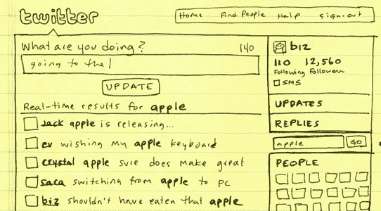

# Twitter 确认并详细介绍了新的“发现引擎”

> 原文：<https://web.archive.org/web/https://techcrunch.com/2009/04/02/twitter-confirms-and-details-new-discovery-engine/>

# Twitter 确认并详述了新的“发现引擎”

今天和昨天，我们已经得到了很多[关于新](https://web.archive.org/web/20230211160955/http://www.loiclemeur.com/english/2009/04/twitter-is-testing-search-saved-searches-on-twittercom.html) [Twitter](https://web.archive.org/web/20230211160955/http://twitter.com/) 主页设计的有限推出的提示，这给了搜索功能一个更突出的位置，以及一些额外的功能。

我们在自己的账户上看不到它，但现在联合创始人[比兹·斯通](https://web.archive.org/web/20230211160955/http://www.crunchbase.com/person/biz-stone)在[博客文章](https://web.archive.org/web/20230211160955/http://blog.twitter.com/2009/04/discovery-engine-is-coming.html)中证实了这一变化，称这一新功能为“发现引擎”。(亚当·杰克逊的 Flickr 账户上的

经过重新设计，搜索框移到了界面的右边栏(目前只针对一小部分用户)，斯通称这是“Twitter 体验中更自然的一部分”。我同意，这表明该公司非常清楚地意识到，实时搜索是一个杀手级功能，他们应该密切关注和培养。当你进行搜索时，结果不再出现在单独的页面上，而是保留在主页上，默认情况下，~~只抓取你关注的账户的推文，~~搜索整个公共 Twitter 流。

您还可以保存搜索查询并在以后重新访问结果。由于你保存的搜索会留在你的主页上，这个功能让人们更容易跟踪围绕某个特定主题(如品牌、事件或人物)的对话，也让过多的第三方监控工具不再适用于基本查询。我们将不得不看看这将如何影响目前以监控 Twitter 对话为中心的应用程序(例如，我们昨天[报道的](https://web.archive.org/web/20230211160955/https://techcrunch.com/2009/04/01/yahoo-launches-slick-desktop-air-app-for-monitoring-twitter/)[雅虎副业](https://web.archive.org/web/20230211160955/http://sideline.yahoo.com/)桌面应用程序)，但很明显 Twitter 越强调这一点，它们就变得越不相关。

Twitter 还将在搜索框下方显示热门话题，这反过来会让人们更容易发现 Twitterverse 在任何给定时间谈论最多的话题。Stone 提醒我们 Trends 还处于测试阶段，但正如他所说，它有潜力。

与此同时，许多人仍然报告说[丢失了推文](https://web.archive.org/web/20230211160955/http://search.twitter.com/search?q=missing+tweets)和直接信息，这个问题已经[持续了几个星期](https://web.archive.org/web/20230211160955/http://status.twitter.com/post/87625680/some-users-experiencing-missing-tweets)。