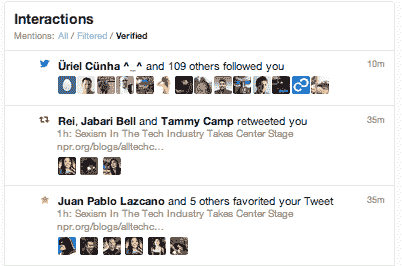

# Twitter 新的“已验证”过滤器让名人可以平静地交流

> 原文：<https://web.archive.org/web/https://techcrunch.com/2013/09/12/twitter-connect-filters/>

# Twitter 新的“验证”过滤器让名人可以平静地交流

名人的生活很艰难。你试图在 Twitter 上回复你的名人朋友，但是对话被疯狂的粉丝和提到你的垃圾邮件发送者淹没了。因此，Twitter 开始向拥有经过验证的个人资料的人推出两个新的连接标签过滤器。过滤，试图减少垃圾邮件，验证，只显示与其他验证配置文件的互动。

Twitter [注意到今天早些时候推出的](https://web.archive.org/web/20221007135338/https://blog.twitter.com/2013/filtering-mentions)，不过你可以在下面的截图中看到它们。

让名人在 Twitter 上保持活跃和快乐是该公司的一大业务，该公司今天刚刚提交了其 [S-1 上市](https://web.archive.org/web/20221007135338/https://beta.techcrunch.com/2013/09/12/twitter-is-going-public-files-s-1-with-sec/)。名人和他们的推文对用户有很大的吸引力，他们访问 Twitter，从演员、运动员、音乐家和其他他们喜欢的名人那里获取最新消息。Twitter 利用了广告浏览量，所以越多的名人喜欢 Twitter，它赚的钱就越多。

*【图片鸣谢:[吉米·基梅尔](https://web.archive.org/web/20221007135338/http://www.youtube.com/watch?feature=player_embedded&v=vr8DyYLT4DE#t=88)*