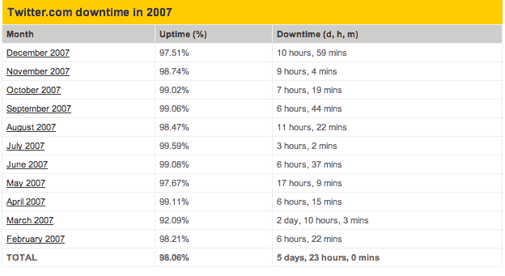

# Twitter 宕机时间正在上升

> 原文：<https://web.archive.org/web/https://techcrunch.com/2007/12/20/twitter-downtime-on-the-upswing/>

# Twitter 宕机时间呈上升趋势

即使在搬到新的数据中心后，Twitter 也经历了一些成长的烦恼。Royal Pingdom [报告](https://web.archive.org/web/20230309163901/http://royal.pingdom.com/?p=227)称，自去年 2 月开始监控这项服务以来，这项服务已经关闭了将近 6 天。到目前为止，12 月份的停机时间几乎超过了之前的任何一个月，接近 11 个小时，而 11 月份为 9 个小时。

我猜每个人都在试图登上那个[高音广播板](https://web.archive.org/web/20230309163901/http://tweeterboard.com/top-100)。

