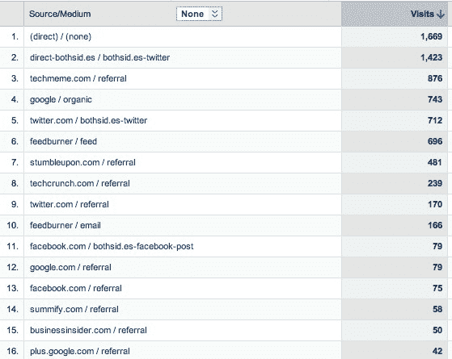

# Twitter 带来的流量是你想象的 4 倍。原因如下...

> 原文：<https://web.archive.org/web/https://techcrunch.com/2011/07/14/twitter-drives-4x-as-much-traffic-as-you-think-heres-why/>

***编者按:**这是 2x 创业者，现为[GRP Partners](https://web.archive.org/web/20230204215617/http://www.grppartners.com/)VC 的马克·苏斯特([@ m uster](https://web.archive.org/web/20230204215617/http://twitter.com/#!/msuster))的客座博文。在苏斯特的创业博客、 *BothSidesoftheTable 上阅读更多关于他的信息。**

*大多数网络发布商使用诸如 Google Analytics、Omniture 或 Core Metrics 等分析软件来衡量他们的流量来自哪里。*

 *在社交媒体出现之前，这些都是很好的帮助找出谁在驱动你的流量的工具。

今天他们错了。大错特错。弄清楚谁在推荐你的流量是决定你如何分配营销预算的一个非常重要的部分。几乎可以肯定的是，Twitter 带来的推荐比你想象的要多得多。

可能高达 4 倍。

乔纳森·施特劳斯是一位做了所有数字运算的绅士，他写了一篇精彩的文章解释为什么会这样。

在投资他的公司(disclosure)之前，我一直是 awe.sm(他的产品)的用户，所以 Twitter 作为推荐来源的低调陈述是我很久以前就知道的问题。让我给你简单解释一下。

 看看昨天[BothSidesofTheTable.com](https://web.archive.org/web/20230204215617/http://bothsidesofthetable.com/)的谷歌分析日志。昨天我有 8502 个访客，其中 1669 个被列为“直接访客”直接流量是直接输入我的网址的人。他们没有被任何人“推荐”。

但是看看第二行。上面写着“direct–both sid . es/both sid . es–Twitter ”,显示了 1423 条推荐信息。第 5 行显示 twitter.com/博思德. es–Twitter“有 712 人推荐，第 9 行显示 twitter.com 有 170 人推荐。

那是什么意思？

awe.sm 追踪我所有的社交媒体分享行为。awe.sm 所做的是，它允许发布者能够跟踪每一个人的分享行为，达到我所知道的任何其他活动跟踪工具都不允许的粒度级别。

在普通的跟踪中，2 号线会显示为“直接”流量，我会假设我得到了比实际更多的直接流量。我本以为我有 36%是直接的，只有 10%是通过 Twitter，但事实是我有 20%是直接的，27%是通过 Twitter。

事实上，实际的 Twitter 推荐量通常是人们认为的 4 倍。几乎可以肯定的是，对于大多数出版商来说，少报推荐也是一样的。

这是一个问题，因为出版商可能会相对于其他人投资不足，因为他们没有得到“最后一英里归属”的权利。

其他营销活动也是如此。你经常会听到广播广告、看到电视广告或读到杂志上的一篇文章，然后在谷歌上输入结果，找到更多关于产品或服务的细节。问题是营销人员认为是谷歌推动了流量。他们没有。所以你减少了电视或印刷广告，突然你的搜索量下降了。

多。

最后一英里归因对于理解营销 ROI 非常重要。对于上述问题，我所知道的最好的公司叫做 [Convertro](https://web.archive.org/web/20230204215617/http://convertro.com/) 。我不是公司的投资者。但是[杰夫·兹韦林](https://web.archive.org/web/20230204215617/http://twitter.com/#!/zwelling)是我交谈过的关于最后一英里归属的最知情的人之一。

在社交媒体领域，这个问题比我描述的还要糟糕。Twitter 是网站社交挂钩的神奇发电机。其中一些来自 Twitter.com 或其他 Twitter 客户。但是，由于许多其他网站拉进 Twitter 数据，包括链接，你并不总是知道是谁向你推荐流量。

典型的例子:LinkedIn。许多推文现在被发送到 LinkedIn，然后发布者假设推荐的来源是 LinkedIn。在某种程度上，这是因为这是你的用户参与内容的地方。但是去掉推文，你就去掉了推荐流量，就像我描述的当你取消电视广告时的损失一样。

所以当我看到 [MG Siegler](https://web.archive.org/web/20230204215617/http://twitter.com/#!/parislemon) 宣布 [LinkedIn 向 TechCrunch 发送的流量超过 Twitter](https://web.archive.org/web/20230204215617/https://techcrunch.com/2011/06/30/linkedin-traffic-twitter/) 时，我不太确定。我理解他为什么会这么想——谷歌分析告诉他的。但我敢打赌，LinkedIn 的大量点击来自 Twitter。我敢打赌，TechCrunch 的大量“直接”流量都来自 Twitter。

有了合适的社交媒体属性，你需要为每个分享行为生成一个唯一的 URL。因此，如果你点击网站上的“Tweet this”按钮向你的朋友发送一篇文章，该链接需要对你和确切的共享实例是个人的。通过使 URL 链接对其生成点是唯一的，当它传播到其他站点时，您可以更好地跟踪它

重要的是，当其他人分享这个网站的链接时，它会映射出一种“父/子”链接关系。因此，如果最初的推文在 Twitter 上，然后有人从 LinkedIn 这样的产品创建了一个“Tweet this ”,你仍然可以看出这个故事的原始来源是 Twitter。称之为“最后一英里社交媒体归因”，当你是一个在产品和营销上花钱的品牌时，你需要知道这一点。

他们还对用户进行 cookie 处理，这样我们就可以更好地跟踪是谁推动了活动的病毒式传播。可能是一个有影响力的人发了一条推特，但他没有很多追随者。如果阿什顿·库彻追随那个人，并突然与他的 700 万追随者分享，这将开始滚雪球。

所以你有它。这个故事永远不会像数据让你相信的那样简单。

图片[由 Fotolia](https://web.archive.org/web/20230204215617/http://www.fotolia.com/) 提供。*