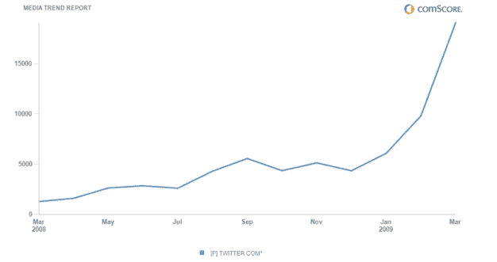

# Twitter 吞噬世界:全球访客飙升至 1900 万 

> 原文：<https://web.archive.org/web/http://techcrunch.com/2009/04/24/twitter-eats-world-global-visitors-shoot-up-to-19-million/>

# Twitter 吞噬世界:全球访客飙升至 1900 万

Twitter 统治世界的步伐仍在继续。今天早上，comScore 发布了 2009 年 3 月的全球数据。据其估计，3 月份到 Twitter.com 旅游的全球游客增加了 95 %,从 980 万增加到 1910 万。相比之下，仅在美国就有 930 万游客。

这些数字只统计了 Twitter 网站的访客，这与活跃用户并不相同，也不包括通过桌面或移动客户端与 Twitter 互动的人(很大一部分用户)。但是 comScore 的数据为 Twitter 的整体增长提供了一个很好的代理，这得益于最近[阿什顿·库彻与 CNN](https://web.archive.org/web/20230204224516/https://techcrunch.com/2009/04/16/kutcher-plays-his-pied-piper-flute-and-gets-a-million-twitter-followers/)的百万粉丝竞赛，以及[奥普拉随后对该服务的采用。](https://web.archive.org/web/20230204224516/https://techcrunch.com/2009/04/20/how-many-new-twitter-users-post-oprah-a-lot-maybe-over-a-million/)

如果 Twitter 能够保持这样的增长率，那么到今年夏天，它的访问量应该会超过 5000 万。