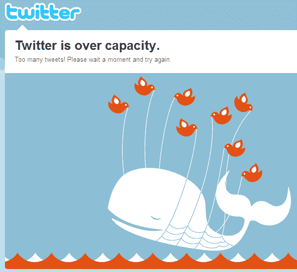

# 嘿，看，这是推特失败鲸！TechCrunch

> 原文：<https://web.archive.org/web/https://techcrunch.com/2010/01/20/twitter-fail-whale/>

# 嘿，看，这是推特失败鲸！

就在昨天，我写了一项名为[API-Status.com](https://web.archive.org/web/20230304023618/http://api-status.com/)的新服务，它监控 26 个流行 API 的[可用性，今天它已经被证明对我很有用。Twitter API 关闭，导致数以千计的第三方应用和服务出现故障。](https://web.archive.org/web/20230304023618/https://techcrunch.com/2010/01/19/watchmouse-api-status/)

当然，简单地访问 Twitter.com 也会让你知道服务中断了，因为东部时间早上 6:40 左右，人们因为“太多的推文”而无法访问该网站。换句话说:欢迎回来，[失败鲸](https://web.archive.org/web/20230304023618/http://failwhale.com/)。

**更新(美国东部时间上午 7:45):**它为我备份。

值得一提的是，根据 Pingdom 的数据，Twitter 本月运行良好，2010 年 1 月至今注册的正常运行时间为 99.89%。

我在想比尔·盖茨可能与此有关。

目前，Twitter 状态网站[上还没有提到任何服务中断的消息，所以我们想知道这项服务预计什么时候会恢复。与此同时，去看看我们的](https://web.archive.org/web/20230304023618/http://status.twitter.com/) [15 条推特关闭时可以做的事情](https://web.archive.org/web/20230304023618/https://techcrunch.com/2009/05/08/twitter-is-down-15-alternative-things-to-do/)帖子。

**更新:**美国东部时间早上 7:25，推特[更新了](https://web.archive.org/web/20230304023618/http://status.twitter.com/post/344235824/extremely-high-volume-of-whales)其状态博客:

> 由于鲸鱼数量过多，我们正在经历停电。我们的待命团队正在解决问题。

(正如评论者所指出的，海地刚刚遭受第二次地震的消息可能会引发关于该主题的大量推文和转发，Twitter 可能无法应对这一突发负载。)

还有别忘了转发这个帖子。你知道，以后吧。