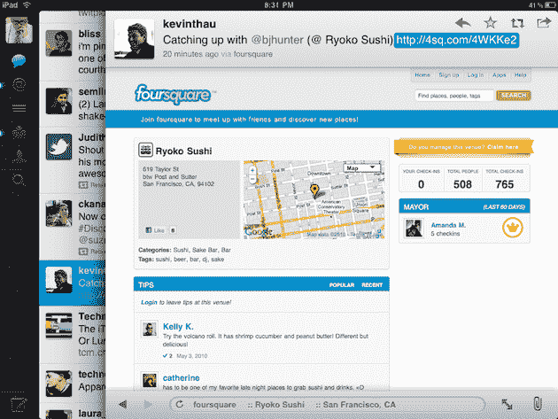
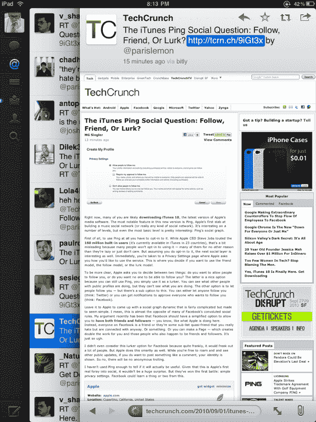
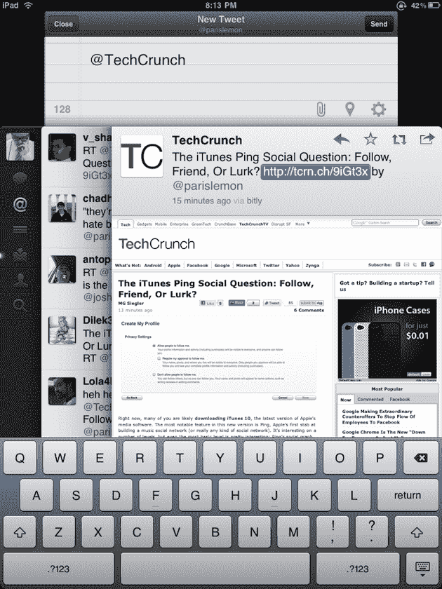
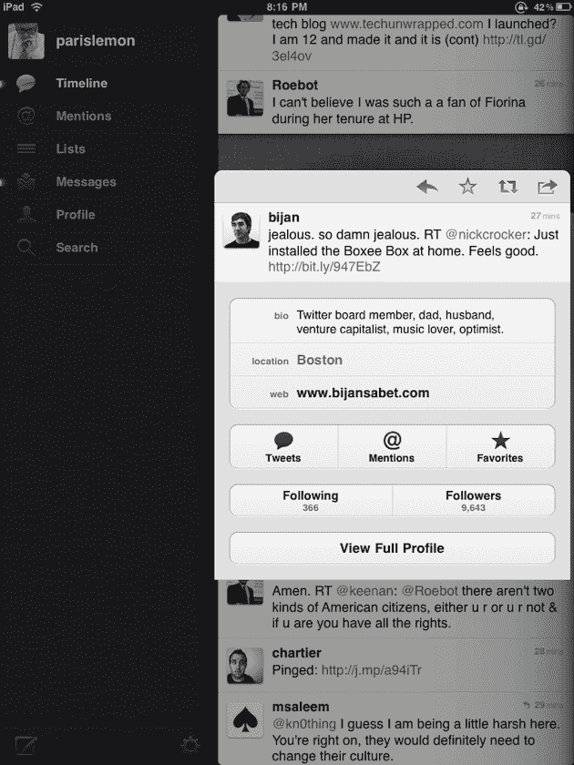

# Twitter 刚刚扼杀了另一个东西:他们自己的网站。iPad 版 Twitter 就是这么好。

> 原文：<https://web.archive.org/web/https://techcrunch.com/2010/09/01/twitter-for-ipad/>

你沉迷于推特吗？你有 iPad 吗？即使现在这两个问题的答案都是“不”,在你看到 iPad 版的 Twitter 之后，这些答案将会改变——很快。

是的，等待结束了。今晚在 App Store 发布的是 Twitter for iPad——该公司的第一款官方原生 iPad 应用。我们都知道它会到来(Twitter 甚至在几个月前就这么说了)，但这是一个漫长的等待。这绝对是值得的。

像大多数人一样，我时不时会陷入夸张。但现在距离我第一次在 iPad 上玩 Twitter 已经有几天了，我仍然认为它无疑是最好的 iPad 应用。有那么好。恕我直言，对于 Reeder、Instapaper、Flipboard 和 Pulse 来说，这将是我阅读新闻的首选应用。对于阅读推文来说，这是一个非常棒的体验——更重要的是，阅读你朋友分享的链接。

Twitter 所做的是为阅读信息创造了令人惊叹的用户体验。这得益于一个直观的用户界面，它层层叠叠。例如，如果我点击我的 tweet 流中的一个链接，我会有一个新的层滚动到定制的浏览器窗口中显示该网页。如果你使用过 Flipboard，它有点类似，但更好，因为它更容易回到你点击链接之前的位置。你只需将某些东西滑动到一边来暂时移动它，或者再次滑动它来将其从屏幕上移除(无论如何，在纵向模式下，那里的空间更少)。

另一件很棒的事情是:当你通过点击一条推文来高亮显示它时，当你滚动你的流时，它现在被钉在屏幕的顶部或底部。如果这是你想参考的东西，那就太好了。在这个应用程序中，对这些类型的保存状态操作进行了大量的思考。例如，保存草稿并返回很简单(比在 iPhone 上使用 Twitter 容易得多)。或者在你自己的推文中引用这些固定推文之一。

Twitter 也为这款应用想出了一些很棒的新手势。例如，如果你在一条推文上向外张开手指，它会向你展示更多关于 Twitter 用户的信息。更好的可能是，你可以用两个手指在任何一条推特上向下滑动，以查看上下文中的完整对话。正是这些小事情让这款应用变得伟大——甚至像苹果一样。

总的来说，这款应用的外观和感觉与 iPhone 版的 Twitter 有很大不同(Twitter 是从今年早些时候收购的开发者 Loren Brichter 的客户端 Tweetie 构建的)。但 Twitter 的 Leland Rechis 向我保证，它在后端使用的都是同样的东西。事实上，Twitter 现在是一个通用的应用程序——这意味着它是一个可以在 iPhone 和 iPad 上运行的应用程序，只是看起来不同，取决于你在哪个设备上使用它。

Rechis 还表示，Twitter 开始在 iPad 版本上尝试一些新的东西，这些东西还没有被带到 iPhone 版本上，但无疑会被带到。一个很好的例子是，当你点击一个用户的个人资料页面时，你会在底部看到一个与你可能喜欢关注的用户相似的用户列表。

Rechis 还指出了注销视图的重要性——这是 Twitter 在 iPhone 版本发布之前就在做的事情。Twitter 希望让这项服务尽可能对人们有用，即使他们没有账户。这个想法，当然，是他们希望注册一个——这个应用程序可能会给他们最大的理由。注销后，你将能够看到基于热门话题的推文流。

“总的来说，推文不仅仅是我在做的事情，它们还有数量惊人的元数据，”Rechis 在谈到为什么他们为这个应用程序创建这个分层的想法时说。他说，现在几乎 25%的推文中都有链接。这款应用非常适合那些推文，以及一般的内容消费和探索。

Rechis 指出，他最喜欢平板电脑的一点是它们消除了窗口管理。同时，您需要某种方法来管理所有这些信息。他指出，布里切特最初的概念是一叠叠的纸张，你可以快速翻阅。Twitter 的其他成员包括 Rechis 完善了这个想法，最终的结果是 iPad 版 Twitter。

这是关于这个应用的大约 750 个单词——但是你真的只需要看到它，并使用它。从现在开始，它肯定会成为我浏览 Twitter 的必经之路。有那么好。

马上去 App Store 找[。这将是一个免费下载。](https://web.archive.org/web/20221208175426/http://itunes.apple.com/us/app/twitter/id333903271?mt=8)

**更新**:我应该注意到，对于这些更高级的手势，有一个轻微的学习曲线。也就是说，你可以不使用那些手势做任何事情，所以这没什么大不了的——只是锦上添花而已。是的，Twitter 正试图想出最好的方法来教用户这些新的手势。

