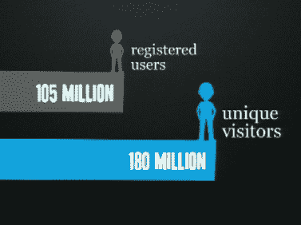

# Twitter 拥有 105，779，710 名注册用户，每天增加 30 万用户 

> 原文：<https://web.archive.org/web/https://techcrunch.com/2010/04/14/twitter-has-105779710-registered-users-adding-300k-a-day/>

# Twitter 拥有 105，779，710 名注册用户，每天增加 30 万人

Twitter 的比兹·斯通刚刚在 Chirp 放出了一些关键的、期待已久的数据。统计数据:

*   Twitter 拥有 105，779，710 名注册用户。
*   一天获得 30 万新用户。
*   每月接待 1.8 亿独立访客。
*   *75%的流量来自 Twitter.com 以外*

 *这些数字有点令人困惑，因为你不必成为注册用户就可以访问 Twitter.com，而且 75%的使用来自其他应用程序，这真的强调了外部开发者的重要性。首席执行官伊万·威廉姆斯后来指出，开发人员每天通过 API 发出 30 亿个请求。

另一个数据:Twitter 现在有 175 名员工，一年前只有 25 名。*