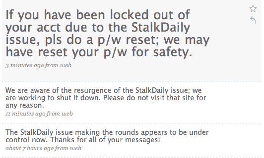

# 警告:Twitter 被 StalkDaily 蠕虫攻击(更新)

> 原文：<https://web.archive.org/web/https://techcrunch.com/2009/04/11/twitter-hit-by-stalkdaily-worm/>

# 警告:Twitter 被 StalkDaily 蠕虫攻击(更新)

Twitter 糟糕的一周变得更加糟糕。该服务显然已经被来自 StalkDaily 网站所有者的蠕虫感染(**注意:不要访问该网站，因为它可能会导致您的计算机被感染**)。目前还不清楚具体细节，但似乎访问受感染用户的 Twitter 个人资料页面也会导致您的个人资料被感染(一些报告称，该蠕虫会修改您的“关于我”部分，以包含该蠕虫的链接)。受感染的用户开始反复发送垃圾推文，将用户导向 StalkDaily 网站。

该攻击似乎起源于今天凌晨，当时一小撮博客帖子弹出来详细描述了该蠕虫。然而，它现在才达到临界质量，仅在过去几分钟内就有数百条相关推文出现在 Twitter 搜索上。Twitter 官方 [Spam watching](https://web.archive.org/web/20221207072214/http://www.twitter.com/spam) 账户今天上午更新，声明该公司已意识到该问题，但该问题已基本解决，并刚刚发布另一条更新，声明该公司已意识到该蠕虫于今天下午死灰复燃。

为了安全起见，坚持使用第三方 Twitter 客户端可能是明智的，在公司确认问题得到解决之前，避免查看个人资料页面。

一些早期的评论表明这是 XSS 对 Twitter 的攻击。其他人指出，攻击可能是在 Twitter 的许多第三方应用程序之一获取 Twitter 用户输入的登录凭据并劫持他们的帐户后开始的。

**太平洋标准时间晚上 9 点更新** : Twitter 在其[状态页面](https://web.archive.org/web/20221207072214/http://status.twitter.com/post/95332007/update-on-stalkdaily-com-worm)发布了以下更新，声明该问题已经修复:

> 36 分钟前 StalkDaily.com 蠕虫更新
> 今天早些时候，我们获悉一个恶意网站通过跨站点脚本漏洞，在未经用户同意的情况下，在 Twitter 上传播 StalkDaily.com 的链接。我们已经采取措施删除违规更新，并堵住让这种“蠕虫”传播的漏洞。
> 
> 在这次攻击中，没有密码、电话号码或其他敏感信息被泄露。

更新:显然 StalkDaily 已经更新了他们的网站，表示这与袭击无关。无论如何，**暂时不要访问**这个网站。

> 每个人都想知道，我没有在 Twitter 上推广和/或参与垃圾邮件。你在这个网站听到的所有不好的事情都不是真的。请重新考虑，因为我不是做这件事的人…StalkDaily 是一个遵循与 Twitter 相同功能的网站，除了更先进的如何？人们可以添加图片和视频，而不仅仅是添加一个“更新状态”。然后你可以跟踪他们，这样当他们上传视频或图片，或评论某人时，你就会知道了！