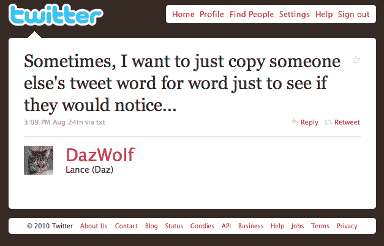
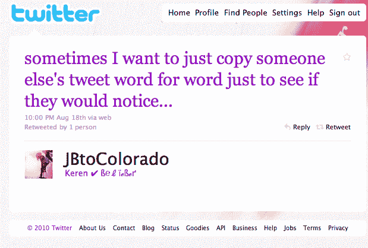
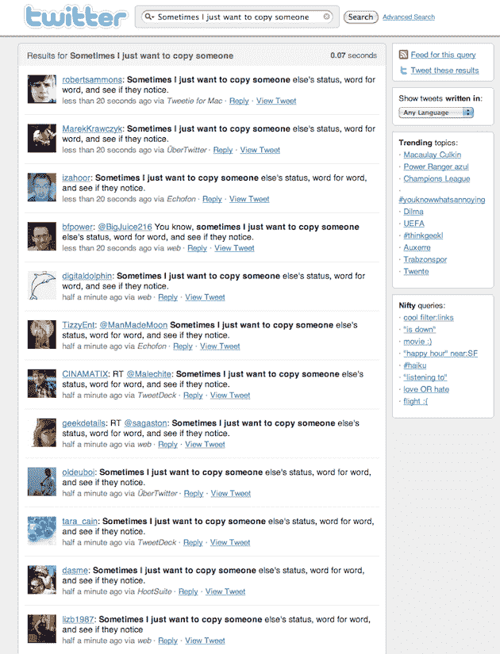

# 有时候我只想一字不差地复制别人的状态，看看他们是否注意到了 

> 原文：<https://web.archive.org/web/http://techcrunch.com/2010/08/26/twitter-human-virus/>

# 有时候我只想一字不差地复制别人的状态，看看他们是否注意到了

我现在很困惑。

现在有件事在推特上传播。它看起来可能是一种病毒，但它不是。只是成千上万的人都在发同样的微博:“*有时候我只想一字不差地复制别人的状态，看看他们有没有注意到*”有些是转发，但大多数只是人们手动输入这些词，并将其发送给所有关注者。我明白了，这很有趣。但没那么好笑。然而，[似乎每个人都在这么做](https://web.archive.org/web/20230202235507/http://search.twitter.com/search?q=Sometimes+I+just+want+to+copy+someone&result_type=recent)。

为什么？嗯，这似乎更多的是一种人性/心理的东西，而不是其他任何东西。我问了一些我认识的人，他们确实发了这些话，为什么他们要这么做。到目前为止，他们都回答说，他们认为他们很可爱，他们是第一个这样做的人。事情就是这样，如果你是第一个这么做的，那就太搞笑了。即使你只是*认为*你是第一个这么做的，这也很有趣。所以在某种程度上，它表达了一种统一的喜剧感。“这是一件美好的事情，”我的同事罗宾·沃特斯说，他之前在推特上发布了这条消息。

迷因在 Twitter 上显然不是什么新鲜事。但是大多数都包含一些愚蠢的标签——或者，是的，一个病毒/机器人只是在胡说八道。这不一样。这是人的本性。这就像如果我在推特上发布“不要转发这个”——许多人会自动转发。这似乎正是这里发生的事情，只有这几十个也有几十个其他的追随者做同样的事情，那些有几十个也做同样的事情，等等。

这就像一个自然复制的人造病毒。这是一个目前正在全世界传播的问题——每一个新的例子都在一点点说明我们都是一样的。这是一件美好的事情。

**更新** : [根据进行高级 Twitter 搜索的 Stephen Ou](https://web.archive.org/web/20230202235507/https://twitter.com/stephenou/status/22202901287) 的说法，用户 [DazWolf 可能是第一个在两天前通过短信发这个短语的人](https://web.archive.org/web/20230202235507/http://twitter.com/DazWolf/statuses/22035171561)。请注意，在这个终极电话游戏中，第一个“，”已经丢失，但又添加了两个…

**更新 2** :看起来 [Mrinal Desai 能够](https://web.archive.org/web/20230202235507/https://twitter.com/mrinaldesai/status/22205521833)使用谷歌新的实时搜索挖掘出一条更早的推文。这里是 8 月 18 日的[JBtoColorado](https://web.archive.org/web/20230202235507/http://twitter.com/JBtoColorado/status/21551372695)——是的，一个贾斯汀比伯的粉丝。

