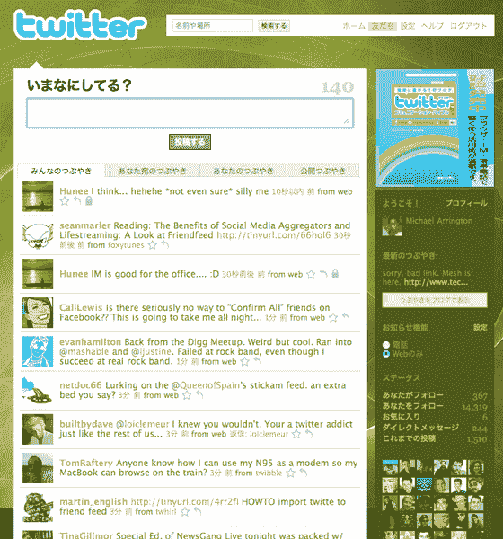

# 推特！日本！广告！

> 原文：<https://web.archive.org/web/http://techcrunch.com/2008/04/22/twitter-japan-ads/>

Twitter Japan [今天在](https://web.archive.org/web/20230203003039/http://blog.twitter.com/2008/04/twitter-for-japan.html) [Twitter.jp](https://web.archive.org/web/20230203003039/http://www.twitter.jp/) 通过 Twitter 和 [Digital Garage](https://web.archive.org/web/20230203003039/http://www.crunchbase.com/financial-organization/digital-garage) 的合作推出了。基本上就是 Twitter，日语，有展示广告。

尽管 Twitter 只有英文版本，但它已经拥有了相当大的日本用户群。所以这肯定是有道理的。我希望对其他语言的支持也能很快跟上。

既然 Twitter 现在是一个公用事业，在开始光荣的扩张之前，没有必要费心去稳定它。祝贺 Twitter 和数字车库团队。

[详见 CNET](https://web.archive.org/web/20230203003039/http://www.news.com/8301-13772_3-9926331-52.html?tag=bl)。