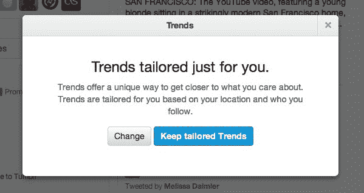

# Twitter 根据你的位置和你关注的人发布定制趋势

> 原文：<https://web.archive.org/web/https://techcrunch.com/2012/06/12/twitter-launches-tailored-trends-based-on-your-location-and-who-you-follow/>

# Twitter 根据你的位置和你关注的人发布定制趋势

Twitter 刚刚[宣布](https://web.archive.org/web/20230316161016/http://blog.twitter.com/2012/06/tailored-trends-bring-you-closer.html)它现在将根据你的位置和你关注的人来个性化它的趋势话题部分。Twitter 表示，这次更新将确保趋势话题列表现在将“显示对你更重要的新兴话题。”您仍然可以切换回标准的非个性化视图，查看特定城市或国家(或全球)的趋势，但定制趋势将成为默认设置。Twitter 目前正在向其所有用户推出这一功能，但这将是一个渐进的推出，所以这些更新的趋势话题可能需要一点时间才会出现在你的帐户中。

Twitter 指出，个性化趋势正降临到它的网络应用和移动应用上。

当然，该公司最近一直在修补更多的个性化功能，包括最近对去年 12 月首次亮相的发现标签的[更新。](https://web.archive.org/web/20230316161016/https://techcrunch.com/2012/05/01/twitter-improves-discover-tab-to-surface-more-interesting-content-promises-to-make-it-magical/)

虽然趋势主题列表总是一个非常有趣的特性，但是可以毫不夸张地说，它对大多数用户来说不是一个非常有用的特性。虽然知道贾斯汀比伯世界正在发生什么总是好的，但听听你真正的朋友在谈论什么可能更有趣。不过，趋势话题板块一直擅长的一件事是突出突发新闻事件。不过，这种情况很可能不会随着今天的更新而改变，因为你的朋友和周围的人可能仍然会在推特上发布这些事件。

