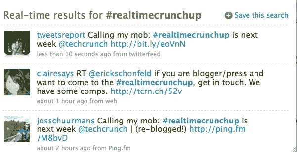

# 推特让标签更有用

> 原文：<https://web.archive.org/web/http://techcrunch.com/2009/07/02/twitter-makes-hashtags-more-useful/>

# 推特让标签更有用

你可能已经注意到推特已经开始给标签添加超链接了。这些词前面有“#”，表示推特是关于什么的，这样可以更容易地搜索关于特定主题和事件的推特。例如，尝试搜索[# real timecrump。](https://web.archive.org/web/20230211233214/http://twitter.com/#search?q=%23realtimecrunchup)现在它们都有超链接，当你点击一个标签时，你会被引导到搜索结果页面找到特定的标签。其他人一直在实施这一点；FriendFeed(大吃一惊)已经做这个有一段时间了。一些推特客户，包括桌面版的推特和 Seesmic 桌面，也提供了标签的超链接。

对推特来说，搜索是一种导航工具，这种功能是让人们在他们的关注群体之外很容易发现新推特的又一种方式。这一趋势始于去年四月他们在每个人的主页上增加了[搜索框](https://web.archive.org/web/20230211233214/https://techcrunch.com/2009/04/02/twitter-confirms-and-details-new-discovery-engine/)。

实时搜索正在升温。就在今天早些时候，FriendFeed 推出了自己的[实时搜索。](https://web.archive.org/web/20230211233214/https://techcrunch.com/2009/07/02/friendfeed-makes-its-search-results-real-time-too/)通过链接到标签，推特给人们提供了另一个进入现有搜索的入口。现在，如果你只能随着时间的推移追踪特定标签的提及。