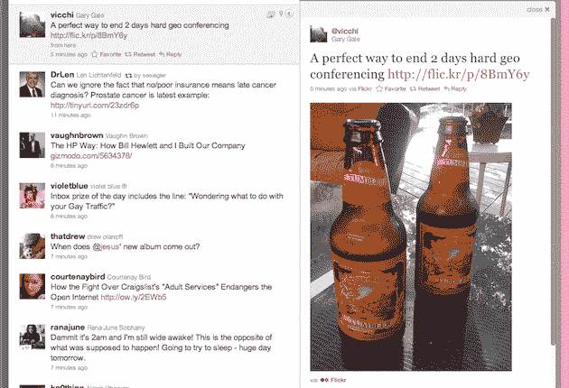
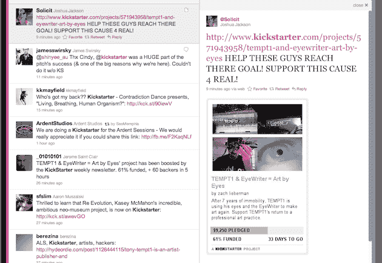

# Twitter 的新迷你平台:右侧窗格 TechCrunch

> 原文：<https://web.archive.org/web/https://techcrunch.com/2010/09/15/twitter-mini-platform/>

虽然 Twitter.com 的[新设计](https://web.archive.org/web/20221206230139/https://beta.techcrunch.com/2010/09/14/twitter-event/)本身是个大新闻，但它对 Twitter 生态系统的意义同样重大。我说的不是与 Twitter 刚刚推出的功能相似的第三方客户端，而是 Twitter 正在(或没有)与之合作、将更多内容直接引入其环境的合作伙伴。

具体来说，我说的是 Twitter 最初的 16 个合作伙伴:Dailybooth、DeviantArt、Etsy、Flickr、Justin。TV、Kickstarter、Kiva、Photozou、Plixi、Twitgoo、TwitPic、Twitvid、USTREAM、Vimeo、Yfrog 和 YouTube。这些服务中的每一个现在都有可以直接从 Twitter.com 观看的内容——潜在地夺走了它们的浏览量。他们究竟为什么会同意呢？

其中一些公司已经给出了他们的外交[答案](https://web.archive.org/web/20221206230139/http://content.usatoday.com/communities/technologylive/post/2010/09/more-on-the-new-twittercom/1)——这种方式对最终用户更好。毫无疑问，这是真的，但是这些网站中的许多都依赖于他们在媒体上展示的广告。此类广告不会在 Twitter.com 上播放。那么，为什么要同意这么做呢？

昨天，在宣布这一消息后，我与 Twitter 产品副总裁詹森·高德曼进行了交谈。他的回答相当有趣。他指出，许多主要的图片和视频公司很早就开始展示将媒体嵌入其他地方的价值。他举了 YouTube 和 Flickr 两个例子。

高盛表示:“这些策略增加了他们品牌的价值。虽然很明显，YouTube 和 Flickr 不再需要太多的帮助来扩展他们的品牌，但较小的玩家肯定会从中受益。如果你看到一个朋友通过 Twitgoo 或 Dailybooth 在 Twitter 上分享一张照片，你可能会决定自己注册这些服务，这样你也可以这样做。

高盛重申，Twitter 不会允许这些合作伙伴在 Twitter 网站新的右侧窗格的图片旁边显示他们自己的广告，但认为图片本身几乎就像是服务本身的一个伟大的品牌广告。

他还指出，他们不会阻止 YouTube 或其他视频服务在嵌入的内容中播放前/后视频广告，因此视频服务将保留一种利用这种嵌入视图赚钱的方式。

显然，Twitter 也愿意与不同的内容合作伙伴进行更多的此类交易。Kickstarter 和 Kiva 的交易特别有趣，因为它们不涉及嵌入式媒体，而是嵌入式内容。期待看到更多这样的场景。事实上，我打算*而不是*大胆猜测，许多定位服务将很快开始在 Twitter.com 的右窗格中显示内容。Foursquare 已经以类似的方式集成到 Twitter 的 iPhone 应用中。

为了让 Twitter.com 成为用户在 T4 更无缝的体验，Twitter 也创造了一种新的迷你平台。以前，他们的平台完全不在现场，右侧窗格也在现场。我想我们可能会看到一些有趣的想法围绕这一点涌现出来。

