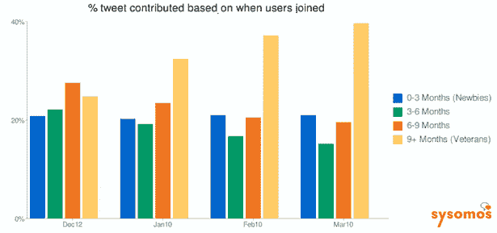
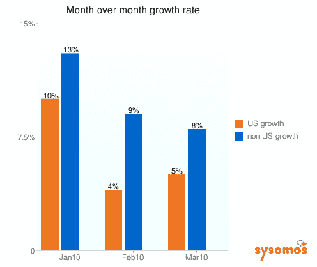
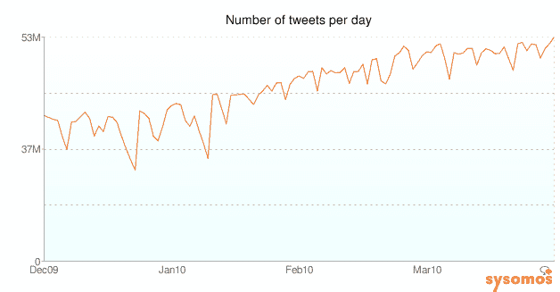

# Twitter 和 9 个月的反弹 

> 原文：<https://web.archive.org/web/https://techcrunch.com/2010/03/29/twitter-nine-month-bounce/>

我一直怀疑 Twitter 的基本使用模式是，人们尝试它，没有得到它，或者因为不认识其他人而气馁，但它最终会在他们身上成长，直到他们开始每天使用它。当然，许多人永远不会回来，但对于那些回来的人来说，他们需要在它成为一种必要的交流工具之前，度过熟悉曲线。

现在我有一些数据来支持我的理论。社交媒体分析公司 [Sysomos](https://web.archive.org/web/20221007221744/http://www.sysomos.com/) 刚刚发布了[一些数据](https://web.archive.org/web/20221007221744/http://www.sysomos.com/insidetwitter/growth/)基于对超过 10 亿条推文的分析，这些数据显示了人们使用该服务的时间长短对更新的贡献。最活跃的用户是那些 9 个多月前加入 Twitter 的人。它们占所有推文的 41.6%。

新用户也很活跃，他们试图了解这项服务，加入不到 3 个月的新手贡献了 22%的推文。然后，对于那些在 3 到 6 个月前(沮丧的低谷)加入的人来说，它下降到所有推特的 15.9%，对于那些在 6 到 9 个月前加入的人来说，它下降到所有推特的 20.5%。趋势相当一致。那些坚持了九个月以上的人的推文出现了大幅反弹。

Sysomos 的数据还显示，国际增长正在超过美国，海外推文增长达到 8%，而美国 3 月份迄今为止的增长率为 5%。这分别低于 1 月份 13%和 10%的增长率。

就推文总量而言，Sysomos 估计现在每天有 5300 万条推文，自 2009 年 12 月以来增长了 30%。大约一个月前，Twitter 的推文量突破了 5000 万大关。(你可以从去年[这里](https://web.archive.org/web/20221007221744/https://beta.techcrunch.com/2009/06/10/the-more-followers-you-have-the-more-you-tweet-or-is-it-the-other-way-around/)阅读 Sysomos Twitter 用户数据的更多分析)。

