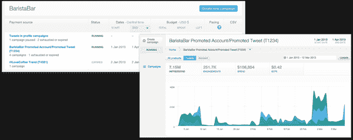
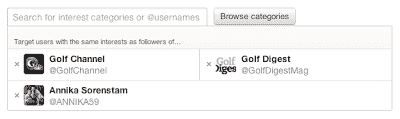
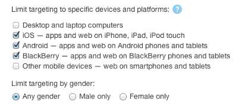

# Twitter 现在允许其自助式广告客户访问先进的活动工具，根据兴趣、设备或性别锁定目标 TechCrunch

> 原文：<https://web.archive.org/web/https://techcrunch.com/2013/03/18/twitter-now-lets-self-serve-advertisers-target-ads-based-on-interests-device-or-sex/>

# Twitter 现在允许其自助式广告客户访问先进的活动工具，根据兴趣、设备或性别来锁定目标

Twitter 希望品牌能够有效地定位他们的广告，否则你为什么要花钱向网络上的每一个人喷洒和祈祷你的信息呢？由于微型社交网站可以根据你关注的人和你互动的帖子类型收集大量关于你的信息，因此这些信息成为广告目的的目标选项是有意义的。

今天，该公司[宣布了一些新的方式，其自助广告客户可以锁定用户](https://web.archive.org/web/20221007105119/http://advertising.twitter.com/2013/03/More-powerful-tools-for-small-business-and-self-service-advertisers.html)做广告，两种新的方式基于兴趣和设备。例如，如果你正在推广一个新的 iOS 应用程序，你将能够只针对 iOS 用户，而不是那些不关心或不点击的 Android 用户。到目前为止，[只有大品牌](https://web.archive.org/web/20221007105119/https://beta.techcrunch.com/2012/08/30/twitter-ads-interest-targeting/)能做这样的事情。

除了定位选项，Twitter 还开放了其[高级活动工具](https://web.archive.org/web/20221007105119/http://advertising.twitter.com/2013/03/The-new-Twitter-Ads-center.html)到*所有*美国广告商:

出于兴趣，Twitter 现在允许广告商选择任何一个账户作为目标。Twitter 给出的例子是，如果你是一家高尔夫商店，你可能想把目标用户锁定在那些关注老虎伍兹(Tiger Woods)的人的兴趣爱好上。这给了品牌一个全新的“社交图谱”,以获取潜在点击者和购买者。实际上，这很有道理。

这种方法的唯一缺陷是，你根本不知道为什么有人会跟踪老虎伍兹，因为这可能与高尔夫无关。说到这里，这是一个逻辑起点。除了从任何账户的关注者的兴趣图开始，你还可以从 350 个兴趣类别中进行选择，这些类别将与用户子集相匹配。同样，这并不完美，但它是一个很好的起点。所有这些目标都允许更好地定制信息，这样就有更好的实际成功机会。

设备定位非常聪明，因为这是 Twitter 可以轻松收集的数据。当广告商建立登陆页面时，这将是非常方便的，现在将有一种简单的方法来确保正确的设备看到正确的页面，而不必担心嗅出人们的设备正在返回什么用户代理。想向一个 iOS 用户炫耀更多的颜色？和黑莓用户相处会更无聊吗？现在您可以:

将这一点与你现在可以将广告瞄准男性或女性的事实联系起来，Twitter 表示，它使用“公共用户信号”来解决这一问题，Twitter 的广告平台正在发展成为对品牌非常有吸引力的平台。仅仅在 Twitter 上是不够的，知道你在和谁说话和向谁做广告才是最重要的。脸书不得不在上市前对其广告产品进行一些调整，看起来 Twitter 也在做同样的事情。

所有这些瞄准听起来令人毛骨悚然吗？太糟糕了，这就是你使用免费服务的结果。我个人更愿意看和我感兴趣的东西有关系的广告。

[图片来源: [Flickr](https://web.archive.org/web/20221007105119/http://www.flickr.com/photos/wfryer/3349087304/)