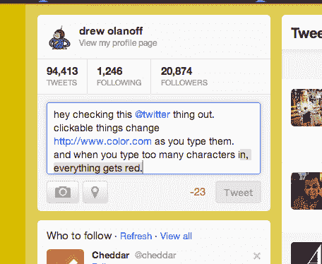

# 现在，当你输入了可点击的内容或超过字符限制时，Twitter 会通知你

> 原文：<https://web.archive.org/web/https://techcrunch.com/2013/01/15/twitter-now-lets-you-know-when-youve-typed-something-clickable-or-went-over-the-character-limit/>

# 现在，当你输入了可点击的内容或超过字符限制时，Twitter 会通知你

这是 Twitter 网站的一个漂亮的小补充。

当你开始撰写推文时，当你添加了一些可点击的内容，如用户名或网址时，文本会改变颜色。文本变为蓝色，这是为了让您知道您已经做了一些“不同”的事情对于新用户来说，或者当你快速输入你最新的惊人想法时，这是一个不错的开始。

同样，如果你超过了 140 个字符，文本会改变颜色，显示为红色，告诉你哪些字符必须删除:

目前，这一功能仅在 Twitter.com 的[上可用。](https://web.archive.org/web/20221207093508/http://twitter.com/)

诸如此类的功能使得 Twitter 的网站对每个人来说都更容易访问，在你打字的时候给你一点切实的反馈。没有人喜欢打出一堆字符却发现空间不够了。到目前为止，您只看到了您输入的超过 140 个字符的数量。通过添加红色突出显示，您可以立即开始刮掉那些多余的字母和数字。

这也将帮助那些出于其他目的使用“@”符号发微博的人，让他们知道他们将在不知不觉中提到某人。

如果你想一想 Twitter 可以在你打字的时候实时添加的所有东西，它是无限的。当你链接一张图片时，它会作为预览显示在有效载荷中。视频也是一样。仔细想想，我不介意看到我将要发布的网页的预览。

如果你在发微博时想知道发生了什么，这就是事情看起来有点不同的原因。嘿，这样可以节省时间。

[图片来源: [Flickr](https://web.archive.org/web/20221207093508/http://www.flickr.com/photos/laughingsquid/4187460211/sizes/z/)