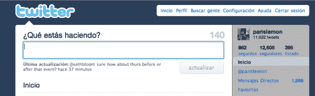

# 推特现在正式登陆西班牙科技频道

> 原文：<https://web.archive.org/web/https://techcrunch.com/2009/11/03/twitter-now-officially-en-espanol/>

# 推特现在正式登陆西班牙

上个月，[推特指出](https://web.archive.org/web/20230205032354/https://techcrunch.com/2009/10/08/twitter-needs-you-to-translate-its-figs/)正在寻找志愿者帮助将其服务翻译成其他语言。今天，第一个已经准备好了，因为推特已经正式宣布支持西班牙语。

推特博客[现在有一篇关于它的帖子](https://web.archive.org/web/20230205032354/http://blog.twitter.com/2009/11/que-estas-haciendo.html)，但是联合创始人[比兹·斯通](https://web.archive.org/web/20230205032354/http://www.crunchbase.com/person/biz-stone)厚颜无耻地完全用西班牙语写了它。我们将继续为您翻译:

> 本月早些时候，我们邀请志愿者将推特翻译成更多的语言。多亏了这些热情的志愿者，推特现在正式开通了西班牙语版本。您可以更改语言或访问 Twitter.com 设置，并在右下角的选项中更改语言设置。
> 
> 一些[说西班牙语的用户]佩佩·阿吉拉尔(@ PepeAguilar)、马努·吉诺比利(@ manuginobili)、何塞·埃尔南德斯(@ Astro_Jose)、安德烈·布纳福内特(@ buenafuente)、胡安·丰塞卡(@ Fonseca)和西班牙的 La Moncloa(@ des delamoncloa)甚至在我们发布翻译版本之前就已经发现了推特的价值。我们希望用西班牙语提供推特，这意味着更多的人能够访问和享受这项服务。
> 
> 欢迎！

西班牙语和日语一样，是推特目前支持的除英语之外的唯一语言。但是更多的事情很快就会发生，因为推特之前提到他们想要“无花果”语言。那里的“S”是西班牙语，其他的是法语、意大利语和德语。

官方对其他语言的支持无疑会帮助推特在最近几个月停滞不前后继续增长。而这种西班牙式的支持也同样适用于雅虎的西班牙推特克隆体(现在英语中也称[)Meme](https://web.archive.org/web/20230205032354/https://techcrunch.com/2009/09/01/yahoo-launches-yahoo-meme-in-english/)。

Twitter 也有一个新的官方西班牙语账户来跟进这项服务。

