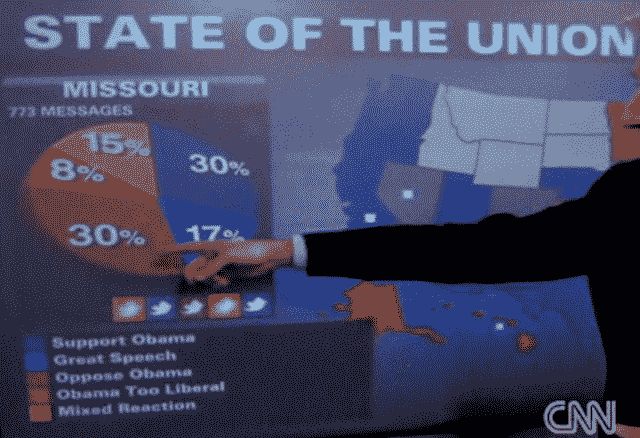

# Twitter 指定 Mass Relevance 和 Crimson Hexagon 为策展合作伙伴 

> 原文：<https://web.archive.org/web/https://techcrunch.com/2011/11/07/twitter-partners/>

# Twitter 指定 Mass Relevance 和 Crimson Hexagon 为策展合作伙伴

Twitter 今天[宣布](https://web.archive.org/web/20230203075620/https://dev.twitter.com/blog/platform-partner-spotlight-mass-relevance-and-crimson-hexagon)与 [Mass Relevance](https://web.archive.org/web/20230203075620/http://www.massrelevance.com/) 和 [Crimson Hexagon](https://web.archive.org/web/20230203075620/http://www.crimsonhexagon.com/) 正式合作，允许这两家公司将推文重新用于网站、电视节目、大屏幕等。大众相关性帮助客户管理 Twitter 的消防水管，这样他们可以展示关于给定主题的最高质量的推文。Crimson Hexagon 对消防水管进行情感分析，让客户判断 Twitter 用户群的意见。

这两家合作伙伴将充当微博平台和希望在其他地方展示其内容的公司之间的中介。这将使 Twitter 能够随着收入的增加而增长推文聚合和分析，而不必建立销售、设计和支持团队。

Twitter 的消防水管每天包括 2.3 亿条推文，每周超过 15 亿条。虽然社交媒体监控工具可以帮助品牌找到对它们或某个主题的提及，但仍然很难过滤掉噪音、垃圾邮件和低质量的推文，然后找出最佳推文或分析它们的意义。Mass Relevance 和 Crimson Hexagon 为他们的客户处理所有这些事情，除了听起来像 Bond 反派的秘密武器。

例如，大众相关性帮助了 E！在线从观众、提名者和评论家那里找到关于 2011 年奥斯卡的最佳推文，然后把它们放在一个微型网站上。Crimson Hexagon 为 CNN 对奥巴马 2010 年国情咨文的分析提供了动力，允许电视网络在演播室的屏幕上投影图表，显示支持奥巴马演讲的推特百分比，认为这太自由了，或者有不同的反应。这也帮助我们理解了为什么我们讨厌 NBC 的冬奥会报道。

这两家公司已经是平台合作伙伴，但新的协议将允许他们重新整合推文或分析其内容，以换取费用，而不用担心被暂停。在宣布这些交易的博客帖子中，Twitter 的开发者关系经理杰森·科斯塔写道，“随着我们寻找新的方式来帮助每个人充分利用 Twitter，预计会看到更多此类合作伙伴关系。”

这些类型的交易将使 Twitter 保持精简，同时建立收入流，不会像短命的[“# Dickbar”那样激怒用户，因为它用广告](https://web.archive.org/web/20230203075620/https://techcrunch.com/2011/03/31/twitter-kills-the-dickbar/)掩盖了 Twitter 的 feed。

【T2