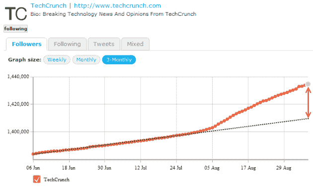
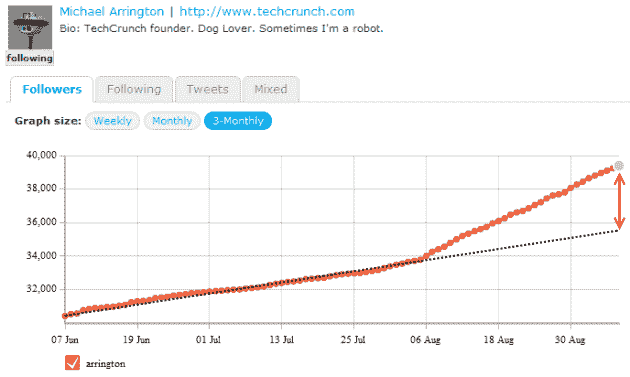
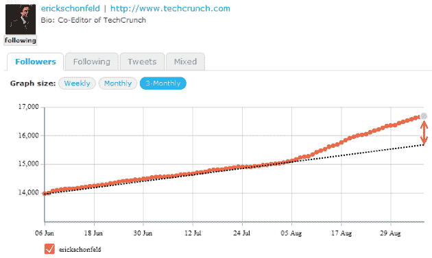
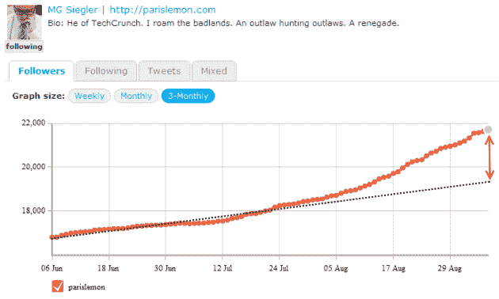
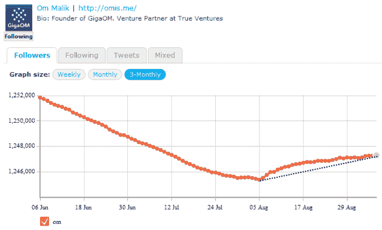
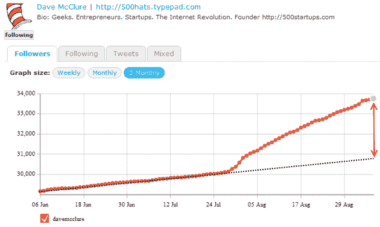
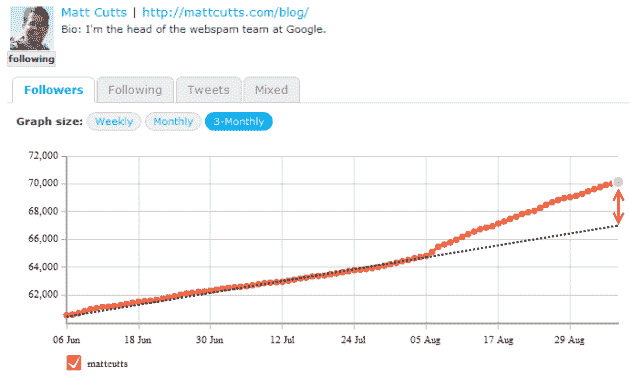
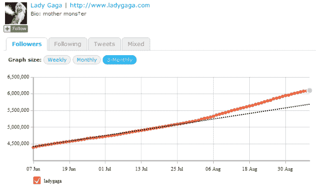
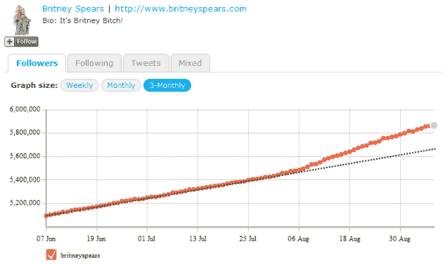

# 非常管用的推荐:Twitter 粉丝增长正在加速

> 原文：<https://web.archive.org/web/https://techcrunch.com/2010/09/06/twitter-people-recommendations/>

# 非常管用的建议:Twitter 追随者的增长正在加速

自从 [Twitter](https://web.archive.org/web/20230222201831/http://www.crunchbase.com/company/twitter) 开启其[人物推荐引擎](https://web.archive.org/web/20230222201831/https://techcrunch.com/2010/08/05/twitter-recommendations/)以来，已经过去了大约一个月，这是一套[算法](https://web.archive.org/web/20230222201831/http://blog.twitter.com/2010/07/discovering-who-to-follow.html)，使得该服务能够[自动推荐你目前不关注但可能感兴趣的人物](https://web.archive.org/web/20230222201831/https://techcrunch.com/2010/07/30/twitter-who-to-follow/)。

Twitter 已经表明，这些建议是基于多种因素的，包括你已经关注的人和他们关注的人。目前，他们只能在 Twitter.com 和寻人部分看到。

根据我的经验，这些算法似乎做得很好，我在 Twitter 上发现了很多我还没有关注的有趣的人，在过去的几周里，我自己的关注者数量显著增加。

所以为了好玩，我决定使用 [TwitterCounter](https://web.archive.org/web/20230222201831/http://twittercounter.com/) 来查找我关注的几个账户的计数，看看这是否是我只为自己的账户注意到的一些事情的总体趋势。

和我一起看:

是的，在我看来这确实像是一种趋势。

由于 Twitter 提供的推荐，即使是下降的粉丝数也可以逆转，正如我们可以从 GigaOm 创始人 [Om Malik](https://web.archive.org/web/20230222201831/http://www.crunchbase.com/person/om-malik) 的[个人 Twitter 账户](https://web.archive.org/web/20230222201831/http://twitter.com/om)看到的那样:

不仅仅是媒体人——例如，看看天使投资人戴夫·麦克卢尔和谷歌人马特·卡茨的趋势:

值得注意的是，自 2010 年 8 月初以来，甚至已经有数百万人关注的名人账户也出现了新粉丝的激增:

现在，我不得不说，这些追随者数量的增加并不是每个 Twitter 账户都能看到的。Gizmodo 和 Engadget 都在增长，但呈线性增长。比尔·盖茨的账户显示出稳定的增长，Twitter 的账户也是如此。看不到如上所示的凸起。

事实上，举例来说，假冒史蒂夫·乔布斯(Steve Jobs)和 T2·谷歌(Google)的 Twitter 账户仍在增长，但明显趋于平稳，而不是快速增长。

然而，我将继续假设 Twitter 的推荐算法如广告所宣传的那样有效，并且自上个月开通该功能以来，他们看到参与度和关注者的数量一直在上升。随着[1.45 亿用户](https://web.archive.org/web/20230222201831/https://techcrunch.com/2010/09/02/twitter-stats/)的增加，这对他们来说显然是一件好事。

现在，等着看当该公司推出一个 API 时会发生什么，该 API 将使第三方开发者能够将新人的建议集成到他们的应用和服务中(他们计划在不久的将来发布)。

在过去的一个月里，你看到你的关注者数量上升了吗？如果没有，我敢打赌你很快就会。