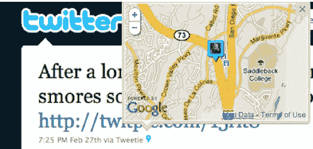

# Twitter 在其地理推文中增加了位置，只是不要称之为签到 

> 原文：<https://web.archive.org/web/https://techcrunch.com/2010/04/14/twitter-places-geo-tweets/>

# Twitter 在其地理推文中增加了位置，只是不要称之为签到

Twitter 正在进入 Foursquare 和 Gowalla 的领地。首席执行官伊万·威廉姆斯刚刚在 Chirp 宣布，它开始增加地理位置功能。Twitter [去年 11 月为开发者开启了地理位置](https://web.archive.org/web/20221127124846/https://beta.techcrunch.com/2009/11/19/twitter-location-api/)，而[上个月开始在](https://web.archive.org/web/20221127124846/https://beta.techcrunch.com/2010/03/09/twitter-location-website/)上玩地图功能。目前，地理推文包含纬度/经度坐标，可以通过城市或社区来识别。但 Twitter 将开始将它们与实际地点进行匹配，这样如果有人在特定地点发布推文，如旧金山的艺术宫，用户将能够看到同一地点的其他推文。Twitter 称这些为兴趣点。

虽然 Ev 没有在舞台上提到它，但 Twitter 很可能正在创建自己的地点目录，可能是通过最近对 Mixer Labs 和 GeoAPI 的收购。一旦你从一个地方发推特，这和签到没有太大区别，这是你在 Foursquare 或 Gowalla 等应用程序中做的事情。

在 Chirp 大会上担任主持人的约翰·巴特利问 Ev，Twitter 是否会推出签到服务。Ev 回应说，这不是目前的计划:“我们不打算复制 Foursquare 和 Gowalla 的功能。当你在推特上发布关于一个地方的消息时，这是一种签到，但我们对那个地方的内容更感兴趣。”

当然，Foursquare 和 Gowalla 以及其他定位应用程序将能够通过 Twitter 的 API 在它们的应用程序中使用关于地点的推文。但是，如果你能发微博说你在哪里，你为什么还要签到呢？想要避免签到疲劳的人可能会坚持使用 Twitter。

*阅读我们的[全啁啾覆盖](https://web.archive.org/web/20221127124846/https://beta.techcrunch.com/2010/04/14/twitter-chirp-our-full-coverage-and-live-stream/)。*