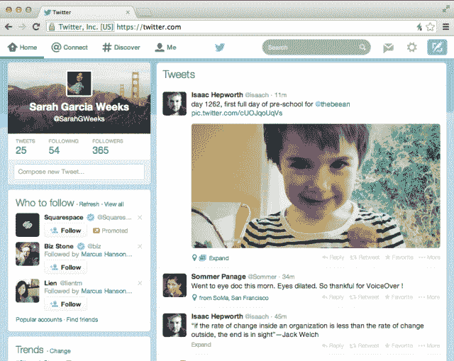

# Twitter 推出符合移动界面的新网页设计 

> 原文：<https://web.archive.org/web/https://techcrunch.com/2014/01/13/twitter-rolls-out-new-web-design-that-eliminates-pop-up-composer-aligns-with-mobile-interfaces/>

# Twitter 推出与移动界面一致的新网页设计

Twitter 今天在网上推出了一个新设计,取消了弹出的撰写窗口，使其外观更符合其移动应用。我们已经[在 Twitter 上看到这种设计的测试版本](https://web.archive.org/web/20220927214312/https://beta.techcrunch.com/2013/11/21/twitter-web-redesign/)有一段时间了，但是这个特别的版本似乎是用户反应最好的测试版。

在某些方面，它看起来很像旧版本的 Twitter——在主时间轴的左侧显示了个人资料框和其他信息。当然，最大的变化之一是，现在在左侧有一个内嵌的撰写框，允许你敲打出推文，而不必处理弹出的撰写框。仍然可以通过右上角的“新推文”按钮和键盘快捷键访问弹出窗口。

将一个撰写框放在左栏会让界面看起来更轻，比起将它放在撰写按钮的下面，会让人们发出更多的 tweet。我猜这是为了将潜伏者转化为推特用户。

如果你们中的一些人正在看这个设计，并且想‘嗯，这就是我的几周以来的样子’，那么恭喜你，你在 Twitter 的测试桶中。该公司进行了大量实验，给 1%的用户一个调整或更新的设计，并测试他们如何与它互动，然后在更大范围内推出变化。几个星期以来，我们一直在收到关于这种特殊设计的报告，或者说是关于它的一些元素的报告。

Twitter 的网页版与其 iOS 和 Android 手机版的结合无疑是有意义的。最近发布的一个大型版本在设计和功能上都有重大变化。在此期间，网络版比之前的版本稍有落后，但现在感觉更自在了。

图片来源:[约翰·维里弗](https://web.archive.org/web/20220927214312/http://www.flickr.com/photos/67485853@N00/2111302096/in/photolist-4dyYyh-4rFWiy-4JCCcC-4QDmRX-5c9H17-5rfpx5-5tpWUY-5x2mvB-5AVVf4-5Bsps9-666Vqv-6ksBWa-6mQM76-6mQMrF-6nwRzj-6nRtB9-6uxHuL-6vCwt4-6Vgh4W-6XJLzX-7nH6BY-7xkMWF-byhmp8-byhjLx-8f3gXh-eU3Y81-8eZ71r-8f3syo-8eZ8eX-baNpaR-eTWbyB-bhXssF-adGUdE-bknsM1-bknuph-bknpfE-byhhL8-bknt5d-byhiEc-byhqTk-byhpoe-bknvRE-bknrJJ-byhqjz-byhhnp-bkntxq-byhoEK-byho6x-bknq91-bx1e3b-8eZ1Hp)