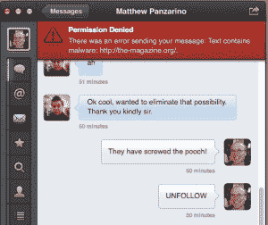

# Twitter 表示，一个“技术问题”导致一些 TechCrunch 网站无法在直接信息中发送网址

> 原文：<https://web.archive.org/web/https://techcrunch.com/2013/10/16/twitter-says-a-technical-issue-is-preventing-urls-from-being-sent-in-direct-messages-for-some/>

# Twitter 表示，一个“技术问题”导致一些人无法在直接信息中发送网址

今天下午早些时候，Twitter 用户开始经历通过直接消息发送 URL 或“链接”的困难。根据所使用的客户端，会弹出错误消息，指示正在发送的 DMs 包含指向“恶意软件”的链接，或者只是指示该消息无法发送。

Twitter 的一位发言人只是说，“直接信息中的网址存在技术问题。”尽管除此之外没有任何信息，但基于垃圾邮件或新的 DM 行为等问题，无法发送带有链接的 DM 似乎不太可能是一个普遍的政策决定，尽管我认为一切皆有可能。

这是一个相当普遍的问题，通过 Twitter 仍然很容易找到账户。经过验证的用户似乎更有可能向其他经过验证的用户和未经验证的用户发送链接。但是，我们已经确认，在某些情况下，即使未经验证的人也可以发送链接。虽然最初的错误信息表明“恶意软件”威胁是导致停止的原因，但错误的不一致性和它们开始的方式突然表明这是一个错误，而不是 Twitter 方面有意改变行为。

虽然 Twitter 上的一些垃圾邮件是通过 DM 发送的，但这比简单的“@回复”垃圾邮件更罕见。通常，你的一个追随者的账户密码必须被泄露才能给你，那个追随他们的人发送 DM。这自然限制了这类攻击的范围，使得对所有 DM 通信的彻底改变不太可能也没有必要。特别是，正如[向我指出的](https://web.archive.org/web/20221209140542/https://twitter.com/chockenberry/status/390711630960418816)，Twitter 本身也使用 DMs 来试验类似推荐的功能。

最近，Twitter 给一些用户提供了[功能，可以从任何人那里接收 DMs](https://web.archive.org/web/20221209140542/https://beta.techcrunch.com/2013/10/15/twitter-direct-messages-all-followers/) ，不管关注状态如何。以前，只有共同关注者可以交换 DMs。这导致了一些猜测，认为 URL DM 失败的原因是这种新行为，不管它是有意的还是新行为展示引起的错误。

我们将继续争取更多关于这一情况的信息，并在收到回复后更新此贴。

图片来源:[将会为这个错误负责](https://web.archive.org/web/20221209140542/http://www.flickr.com/photos/85455733@N00/4061272470/in/photolist-7bT5P9-7cULLg-7dFx8o-7iwe3T-7koX5Q-7pYtqX-7u6FE1-7u6FVu-7xeyAc-e6CWt2-aEzPJs-bVzwXd-amhr7g-dXkgRC-dj8wYm-7V553P-9XGLRZ-9p6vAX-cXc6F5-ci1MxA-bpBNym-awZJSe-bCFpKj-byhXJM-e8eqjh-anRNSq-8Gu4ms-8WTzFE-7EhA5Z-7Va8Bu-dG5gzQ-e33zx1-9EDkHr-ed6nVi-935Wiy-f6KLEp-adiAad-ax3qi5-awZARz-ax3heN-awZHbv-awZKZF-9cpBQg-9dDjnD-eik9P5-8UySzb-9ugDfX-djx6cd-8g5Mxa-97286T-7Bf7Ye) /Flickr CC 和[格伦·弗莱什曼](https://web.archive.org/web/20221209140542/https://twitter.com/GlennF)